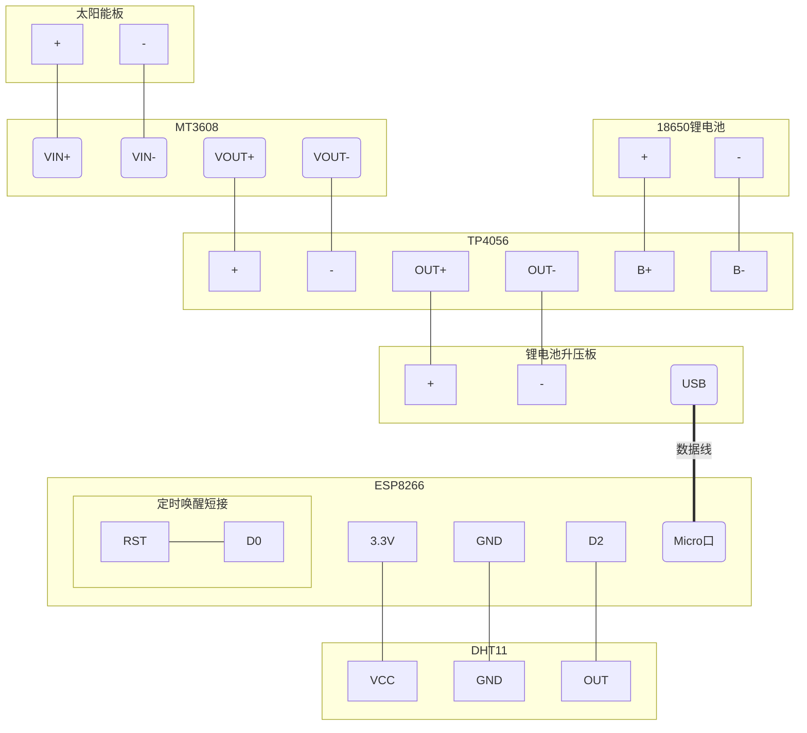

### 概述

这篇文章介绍了使用太阳能板、ESP8266开发板和 DHT11 传感器模块制作气象站，开发板定时采集温湿度数据上报到服务器，白天使用太阳能板给 18650 电池充电，晚上和光线弱的环境使用电池供电，支持低功耗长时间运行。

 

<!-- more -->

### 物料

#### 硬件

| 名称                      | 数量 | 价格  | 备注                                     |
| ------------------------- | ---- | ----- | ---------------------------------------- |
| ESP8266                   | 1    | ￥10  |                                          |
| 3V太阳能板                | 1    | ￥3   | 已焊线，60*60多晶滴胶板                  |
| DHT11温湿度传感器模块     | 1    | ￥2.2 |                                          |
| TP4056锂电池充电模块      | 1    | ￥6.8 | 购买的套装，包含充电模块、升压板、电池盒 |
| 移动电源升压板（带USB口） | 1    |       |                                          |
| 18650电池盒（单节）       | 1    |       |                                          |
| 18650锂电池               | 1    | ￥10  |                                          |
| MT3608升压板              | 1    | ￥4   |                                          |
| 杜邦线                    |      |       |                                          |
| 导线                      |      |       |                                          |


#### 软件

| 名称           | 版本     | 下载链接                                        | 备注                       |
| -------------- | -------- | ----------------------------------------------- | -------------------------- |
| Arduino        | 1.8.9    | https://www.arduino.cc/en/software              | 编写、烧录ESP8266代码      |
| IntelliJ IDEA  | 2025.2.3 | https://www.jetbrains.com/idea/                 | 编写、运行服务端代码       |
| MySQL          | 8.0.39   | https://www.mysql.com/cn/downloads/             | 存储上报的温湿度传感器数据 |
| Docker Desktop | 4.79.0   | https://www.docker.com/products/docker-desktop/ | (可选)用于安装MySQL        |


#### 工具

| 名称        | 用途                                                         | 备注 |
| ----------- | ------------------------------------------------------------ | ---- |
| Windows电脑 | 编写、烧录 ESP8266 代码，编写、运行服务端代码与数据库        |      |
| 电烙铁      | 用于焊接导线和板卡模块                                       |      |
| micro数据线 | 开发调试时将 ESP8266连到电脑上烧录程序，后期连接开发板和锂电池升压板，用于给开发板供电 |      |
| 万用表      | 检测 MT3608升压板输出电压                                    |      |
| 直流电源    | （可选）调试阶段可给MT3608升压板供电，用于调节配置           |      |


### 原理

#### 太阳能充电

本次使用的太阳能板标称输出电压为 3V，经测试在光照充足的情况下，输出电压为 3.5V，光照不足时电压降低，此电压无法直接给 ESP8266 供电（需要5V），也无法给锂电池充电（锂电池充电电压需高于4.2V）。

因此，需要使用 DC-DC 升压板，将 3.5V先升压到 5V，再送进充电模块。本次使用的是 MT3608 模块，支持输入2.5V-15V，输出电压可调（最大 28V），最大输出电流 2A。

 


本项目使用带充放电保护的 TP4056 锂电池充电模块，太阳能板提供的 3.5V电压经过 MT3608 升压到 5V，再输入到 TP4056 为电池充电。

 


#### 锂电池供电

本项目使用单节 18650 电池作为电源，充满时能够提供 4.2V输出，但 ESP8266 需要 5V电源输入，因此在电池输出端还需要使用升压模块将电压提升到 5V给开发板供电。

本次使用的是带 USB口的锂电池升压模块，能够将锂电池输出电压提升至 5V，同时自带了 USB口，方便使用 USB-Micro 数据线给开发板供电。

 


#### 读取温湿度数据


#### 上传温湿度数据到服务端


### 安装与连线




### 代码

#### 开发板代码

代码主要逻辑：

- 设定 WiFi名称、密码、服务端地址、DHT11数据读取引脚。
- 在 setup 函数中完成连接 WiFi、读取 DHT11 数据、向服务器发送上报数据请求，调用 `ESP.deepSleep()` 函数让开发板深度休眠。
- loop 函数为空。

```C
#include <Arduino.h>
#include <DHT11.h>
#include <ESP8266WiFi.h>
#include <ESP8266WiFiMulti.h>
#include <ESP8266HTTPClient.h>
#include <WiFiClient.h>

#ifndef STASSID
#define STASSID "<WiFi名称>"
#define STAPSK "<WiFi密码>"
#endif

ESP8266WiFiMulti WiFiMulti;
const char* server = "http://192.168.2.88:8080"; // 服务器地址
DHT11 dht11(D2);

void setup() {
  Serial.begin(115200);
  WiFi.mode(WIFI_STA);
  WiFiMulti.addAP(STASSID, STAPSK);
    if ((WiFiMulti.run() == WL_CONNECTED)) {
    int temperature = 0;
    int humidity = 0;
    int result = dht11.readTemperatureHumidity(temperature, humidity);
    result = dht11.readTemperatureHumidity(temperature, humidity);
    String postStr = server;
    postStr+="/api/weather/upload?temperature=";
    postStr+=temperature;
    postStr+="&humidity=";
    postStr+=humidity;
    Serial.println(postStr);
    WiFiClient client;
    HTTPClient http;
    Serial.print("[HTTP] begin...\n");
    if (http.begin(client, postStr)) {  // HTTP
      int httpCode = http.GET();
      if (httpCode > 0) {
        Serial.printf("[HTTP] GET... code: %d\n", httpCode);
        if (httpCode == HTTP_CODE_OK || httpCode == HTTP_CODE_MOVED_PERMANENTLY) {
          String payload = http.getString();
          Serial.println(payload);
        }
      } else {
        Serial.printf("[HTTP] GET... failed, error: %s\n", http.errorToString(httpCode).c_str());
      }
      http.end();
    } else {
      Serial.println("[HTTP] Unable to connect");
    }
  }
  ESP.deepSleep(600000000);
}

void loop() {
}
```


#### 服务器代码


### 测试


### 总结


