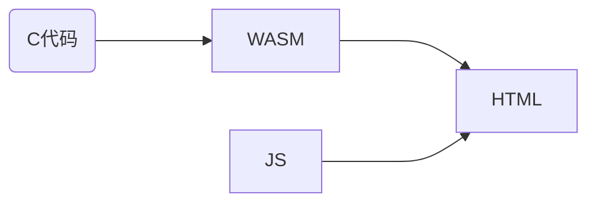

### 概述

这篇文章介绍了在 JavaScript 中通过 WebAssembly 调用 C 语言编写的函数，以及在 C 代码中调用 JavaScript 函数。


### web 使用 wasm 流程

在 web 项目中使用 WebAssembly 时，需要先编写 C 语言代码，然后使用 emscripten 编译成 `.wasm` 和 `.js` 文件，最后在 html 文件中引入 js 文件，就可以调用在 C 中定义的函数。在 wasm 中是无法操作 dom 的，需要结合 js 使用。



> 注意：使用 emscripten 自动生成的 js 文件是对 wasm 的实例化和调用函数的封装，方便使用，这个 js 文件中对各种运行环境（node、shell、web、worker）做了支持，实际使用时可以根据自己的业务需求，排除不需要的代码以缩小 js 文件代码量，或自己编写封装成 js 文件。

<!-- more --> 

### WEB JS 中使用 WASM

目前在浏览器中还不支持直接引入使用，使用 WebAssembly 的方法是创建一个包含 WebAssembly 模块二进制代码的 `ArrayBuffer` ，然后使用使用 `WebAssembly.instantiate()` 编译实例化。

在 web 浏览器中，使用 `fetch` 或 `XMLHttpRequest` 从服务端获取 `.wasm` ，使用 `arrayBuffer()` 将响应转换成 `ArrayBuffer` ，然后使用 `WebAssembly.instantiate()` 编译和实例化。

```js
```


### JS 调用 C 函数

#### C 语言代码

在 C 语言代码中，首先需要包含 emscripten 的头文件 `emscripten.h` ，然后使用 `EMSCRIPTEN_KEEPALIVE` 宏来指明要导出的函数， 如果未使用 `EMSCRIPTEN_KEEPALIVE` 宏，在某些情况下会导致未被调用的函数被编译器优化掉。

`jsCallCFunc.c` 

```c
#include <stdio.h>
#include <emscripten.h>

EMSCRIPTEN_KEEPALIVE
void sayHi() {
  printf("Hi!\n");
}

EMSCRIPTEN_KEEPALIVE
int getInt() {
  return 99;
}

EMSCRIPTEN_KEEPALIVE
float add(float a, float b) {
  return a + b;
}

EMSCRIPTEN_KEEPALIVE
void greeting(char *name){
  printf("Hello, %s\n", name);
} 
```

> 在上述 C 代码中，定义了无参无返回值的函数、无参返回整数的函数、多个浮点型参数返回浮点型数据的函数、字符指针参数的函数。


#### 编译 wasm

编译命令（powershell）：

```powershell
emcc .\jsCallCFunc.c -o jsCallCFunc.html -sDEFAULT_LIBRARY_FUNCS_TO_INCLUDE=$stringToNewUTF8 -sEXPORTED_FUNCTIONS="_malloc,_free"
```

> 编译选项说明：
>
> - `DEFAULT_LIBRARY_FUNCS_TO_INCLUDE` 指定要导出的库函数，这里导出了函数 `stringToNewUTF8` ，用于在 JavaScript 中将字符串转换字节数组，用于将字符串擦书传递给 C 函数。
> - `EXPORTED_FUNCTIONS` : 要导出的函数，因为库函数 `stringToNewUTF8` 依赖函数 `malloc` 所以需要导出，导出时要在函数名前加下划线 `_` 。因为使用 `malloc` 函数分配内存后，需要使用 `free` 函数释放内存，所以需要同时导出 `free` 函数。


#### JS 中调用 C 函数：

将编译得到的 `.wasm` 、`.js` 、`.html` 文件放到 web 服务器中，使用浏览器访问，打开开发者工具并进入控制台，在控制台输入函数进行调用：

引入使用 emscripten 生成的 js 文件，可以使用 `Module._func（）` 或直接使用  `_func()`  来调用 c 中定义的函数。需要注意的是，对于字符串参数的传递方式，在 JavaScript 中，需要使用 `stringToNewUTF8` 函数将 js 字符串转成字节数组并获取其指针，然后通过传递指针的方式传参给 C 函数。

```javascript
Module._sayHi();
// 或 _sayHi();￥

Module._getInt();
// 或 _getInt();

Module._add(3, 2);
// 或 _add(3, 2);

let name = stringToNewUTF8('world');
Module._greeting(name);
Module._free(name);
```


#### 注意事项

在 C++ 中，为了防止编译 wasm 时导出的函数名不确定，需要使用 C 语言方式导出函数，建议添加宏来统一处理。

`wasm_common.h` 

```C
#ifndef __WASM_COMMON_H_
#define __WASM_COMMON_H_

#ifndef EM_PORT_API
#  if defined(__EMSCRIPTEN__)
#    include <emscripten.h>
#    if defined(__cplusplus)
#      define EM_PORT_API(rettype) extern "C" rettype EMSCRIPTEN_KEEPALIVE
#    else
#      define EM_PORT_API(rettype) rettype EMSCRIPTEN_KEEPALIVE
#    endif
#  else
#    if defined(_cplusplus)
#      define EM_PORT_API(rettype) extern "C" rettype
#    else
#      define EM_PORT_API(rettype) rerttype
#    endif
#  endif
#endif

#endif
```

> 代码说明：在上述代码中，通过 检查宏`__EMSCRIPTEN__` 判断是否 emscripten 环境，如果不是，就按普通 C/C++ 处理。
>
> 如果是 emscripten 环境，则包含 `emscripten.h` 头文件，并通过检查宏 `_cplusplus` 判断是否 C++ 环境，分辨定义宏 `EM_PORT_API` 的内容。


修改 C 语言代码：

```C
#include <stdio.h>
#include "wasm_common.h"

EM_PORT_API(void) sayHi() {
  printf("Hi!\n");
}

EM_PORT_API(int) getInt() {
  return 99;
}

EM_PORT_API(float) add(float a, float b) {
  return a + b;
}

EM_PORT_API(void) greeting(char *name) {
  printf("Hello, %s\n", name);
} 
```


### C 调用 JS 函数

#### emscripten_run_script()


#### EM_JS()


#### EM_ASM()


### 注意事项


### 参考资料

- Interacting with code | Emscripten中文网: <https://emcc.zcopy.site/docs/porting/connecting_cpp_and_javascript/interacting-with-code/> 
- Interacting with code — Emscripten 3.1.42-git (dev) documentation: <https://emscripten.org/docs/porting/connecting_cpp_and_javascript/Interacting-with-code.html> 
- 丁尔男, 柴树杉. 《面向WebAssembly编程：应用开发方法与实践》. 机械工业出版社, 2021
- 加载和运行 WebAssembly 代码 - WebAssembly | MDN: <https://developer.mozilla.org/zh-CN/docs/WebAssembly/Loading_and_running> 


### 总结
