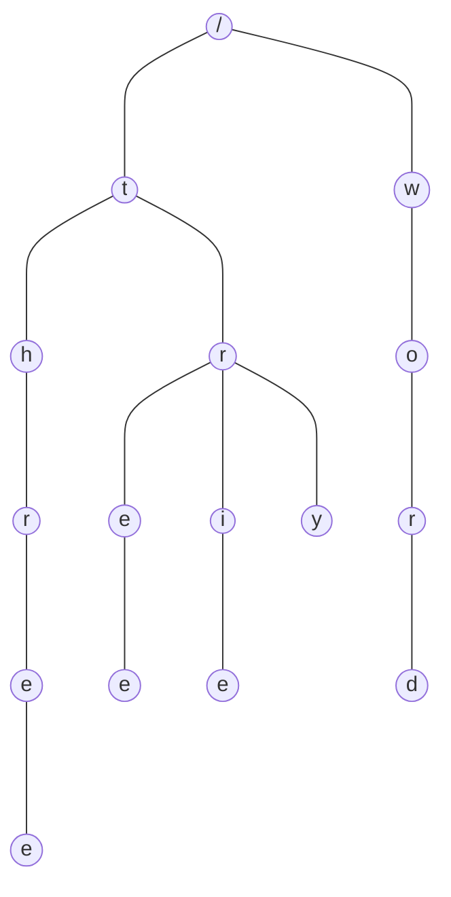

### 概述

Trie 树，又称前缀树、字典树，是一种有序树形结构，是哈希树的变种，用于保存关联数组，通常是字符串。与二叉查找树不同，键不是保存在节点中，而是由节点在树中的位置决定。一个节点的所有子孙都有相同的前缀。一般情况下不是所有的节点都有对应的值，只有叶子节点和部分内部节点所对应的键才有相关的值。

<!-- more -->

### 特点

- 根节点不包含任何字符，除根节点外每个节点只包含一个字符。
- 从根节点到某个节点，路径上经过的字符连接起来，为该节点对应的字符串。
- 每个节点的所有子节点包含的字符串不相同。

### 使用场景

- 字符串检索
- 文本预测、自动完成、拼写检查
- 词频统计
- 排序，先序遍历 Trie 树即可获得字典排序的字符串结果
- 查找字符串最长公共前缀
- 字符串搜索的前缀匹配，如搜索引擎中的搜索提示
- 作为其他数据结构和算法的辅助结构，如后缀树，AC自动机等

### 优缺点

#### 优点

Trie树利用公共前缀，可以最大限度减少无谓的字符比较，缩小查词范围，使得搜索的时间复杂度理论上只与检索词的长度有关，故可以用于词频统计和大量字符串排序。

#### 缺点

- Trie 是一个以空间换时间的算法（尤其是早期的Trie树），每个字符都可能包含至多字符集大小数据的指针。
- 如果数据存储在外部存储器等较慢的位置，Trie 会较 hash 速度慢。
- 长的浮点数等会让链变得很长，可用 bitwise trie 改进。

### 实现方式

#### Array Trie 树

又称经典 Trie 树，实现结构简单，检索效率高。特点是：每个节点都由指针数组存储，每个节点的所有子节点都位于一个数组之中，每个数组都是完全一样的。

对于英文，每个数组有27个指针，包含一个终止符和26个字母，字母按顺序放入数组中。如果包含某个字母，则将数组中对应位置的指针置为可用状态，要查询某个字母是否在节点中，则按直接按位置取用即可。

这种方式利用了元素的值和位置的一一对应关系，实现寻址、存值、取值的统一。

缺点是每一个节点都要有一个等长的数组，包含全部值。在实际使用中会出现很多浪费的数组指针，是典型以空间换时间的做法。

#### List Trie 树

使用 List 替换经典 Trie 树中的数组，解决了空间浪费的问题。但使用链表后，取词时需要遍历链表，降低了查询效率；

#### Hash Trie 树

使用键值对结构替换List，每个节点包含一组 Key-Value，每个key对应该节点下的一个子节点字符，value则指向相应的后一个状态。这种方式能够有效减少空间浪费，查询效率也很高。

#### Double-array Trie 树

双数组树是目前 Trie 树中性能和存储空间均达到很好效果的实现，但实现比较复杂。

### 示例

### 参考资料

- Trie（前缀树/字典树）及其应用: <https://www.cnblogs.com/bonelee/p/8830825.html> 
- 看动画轻松理解「Trie树」: <https://www.sohu.com/a/300621285_115128> 
- 字典树(Trie树)实现与应用: <https://www.cnblogs.com/xujian2014/p/5614724.html> 
- 小白详解 Trie 树: <https://segmentfault.com/a/1190000008877595> 
- Trie - 维基百科: <https://zh.wikipedia.org/wiki/Trie> 
- Trie（前缀树/字典树）及其应用: <https://www.cnblogs.com/justinh/p/7716421.html> 

### 总结