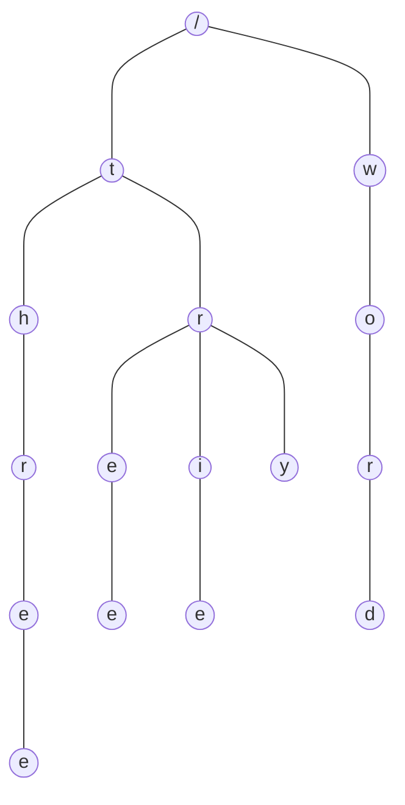

### 概述

Trie 树，又称前缀树、字典树，是一种有序树形结构，是哈希树的变种，用于保存关联数组，通常是字符串。与二叉查找树不同，键不是保存在节点中，而是由节点在树中的位置决定。一个节点的所有子孙都有相同的前缀。一般情况下不是所有的节点都有对应的值，只有叶子节点和部分内部节点所对应的键才有相关的值。

<!-- more -->

### 特点

- 根节点不包含任何字符，除根节点外每个节点只包含一个字符。
- 从根节点到某个节点，路径上经过的字符连接起来，为该节点对应的字符串。
- 每个节点的所有子节点包含的字符串不相同。

### 使用场景

- 字符串检索
- 文本预测、自动完成、拼写检查
- 词频统计
- 排序，先序遍历 Trie 树即可获得字典排序的字符串结果
- 查找字符串最长公共前缀
- 字符串搜索的前缀匹配，如搜索引擎中的搜索提示
- 作为其他数据结构和算法的辅助结构，如后缀树，AC自动机等

### 优缺点

#### 优点

Trie树利用公共前缀，可以最大限度减少无谓的字符比较，缩小查词范围，使得搜索的时间复杂度理论上只与检索词的长度有关，故可以用于词频统计和大量字符串排序。

#### 缺点

- Trie 是一个以空间换时间的算法，

### 实现方式

### 示例

### 参考资料

- Trie（前缀树/字典树）及其应用: <https://www.cnblogs.com/bonelee/p/8830825.html> 
- 看动画轻松理解「Trie树」: <https://www.sohu.com/a/300621285_115128> 
- 字典树(Trie树)实现与应用: <https://www.cnblogs.com/xujian2014/p/5614724.html> 
- 小白详解 Trie 树: <https://segmentfault.com/a/1190000008877595> 
- Trie - 维基百科: <https://zh.wikipedia.org/wiki/Trie> 
- Trie（前缀树/字典树）及其应用: <https://www.cnblogs.com/justinh/p/7716421.html> 

### 总结