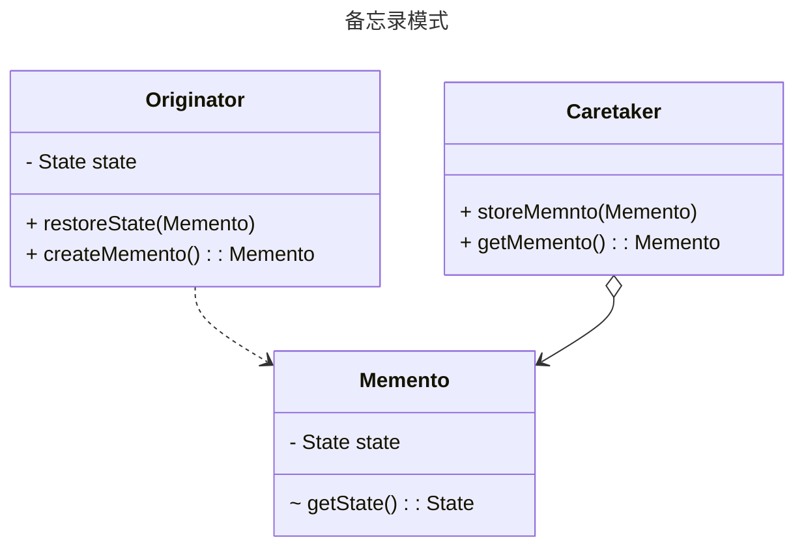
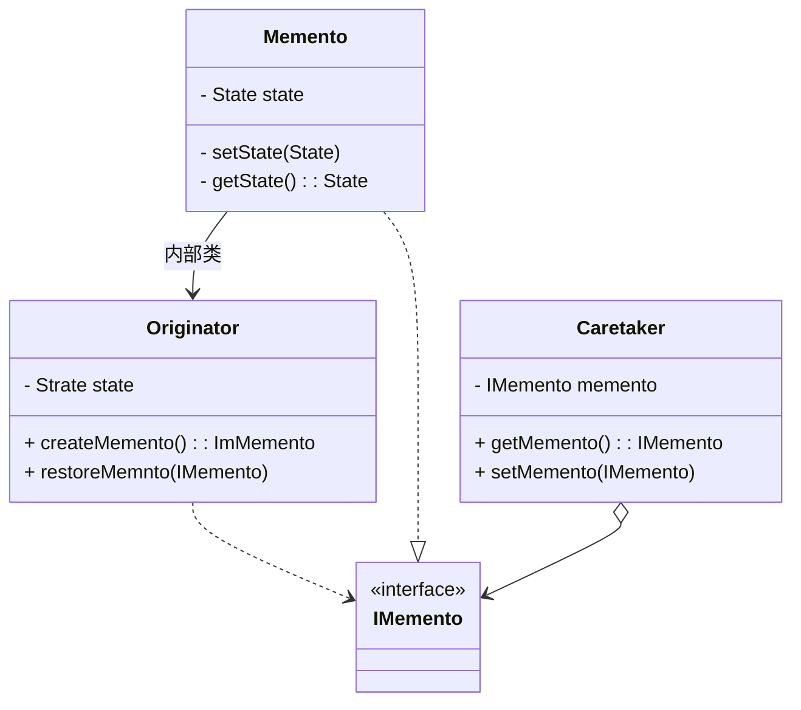

### 概述

备忘录模式属于行为模式，目的是保存和恢复内部状态，用于需要保存对象某一时刻的全部或部分状态，以便有需要时恢复到先前状态。适用场景：编辑－撤销、存档－恢复、数据库回滚。

### 认识备忘录模式
备忘录（Memento）用于在不破坏对象封装的基础上，将目标对象内部的状态存储到外部对象中，以备之后恢复状态时使用。

备忘录模式中的角色：
- 发起人（Originator）：需要备份状态的对象，负责创建备忘录对象和使用备忘录对象恢复自身状态。
- 备忘录（Memento）：用于保存状态数据。
- 备忘录管理员（Caretaker）：存储和管理备忘录。

<!-- more -->

### 使用场景

- 需要保存和恢复状态的场景：游戏存档
- 操作和回滚的场景：Ctrl +Z 撤销操作，浏览器、文件浏览器的后退操作，数据库事务

### 代码示例

### 注意事项

#### 备忘录要保存在发起人外部

备忘录保存在发起人外部是为了防止发起人在使用过程中意外修改了备忘录信息，在使用备忘录模式时，要注意保证数据不被修改，保证数据洁净不被污染，如果数据被修改了就失去了备份状态的意义。因此，在java中，可以把 Memento 类定义为发起人的私有内部类，这个内部类里的方法全都是私有的，这样备忘录对象保存的状态就只有发起人可以使用了。

> 增加一个空的 IMemento 接口，这个接口里不包含任何行为，目的是为其他模块提供访问权限，但不提供任何操作权限。

#### 要备份的内容由发起者决定

可以备份发起者全状态，也可以是部分关键装填。同时备份方法也由发起人决定，如果使用 java 的类序列化接口或 clone 接口完成备份状态，可以不要 Memento类。

#### 备忘录生命期

备忘录对象创建后要在近期代码中使用，如果不需要了要及时删除，让 jvm 回收内存空间。

#### 备忘录性能

不要在频繁备份的场景中使用备忘录模式，比如在循环中，因为频繁创建备忘录对象会消耗性能和资源，二是无法控制创建备忘录的数量。

#### 发起人自我完成备份与恢复

在比较简单的场景中，可以在发起人内部保存备忘录对象，并由其自身完成状态恢复，以减少类的数量，降低复杂度。

### 参考资料

- 《设计模式之禅》
- 备忘录模式: <https://refactoringguru.cn/design-patterns/memento> 
