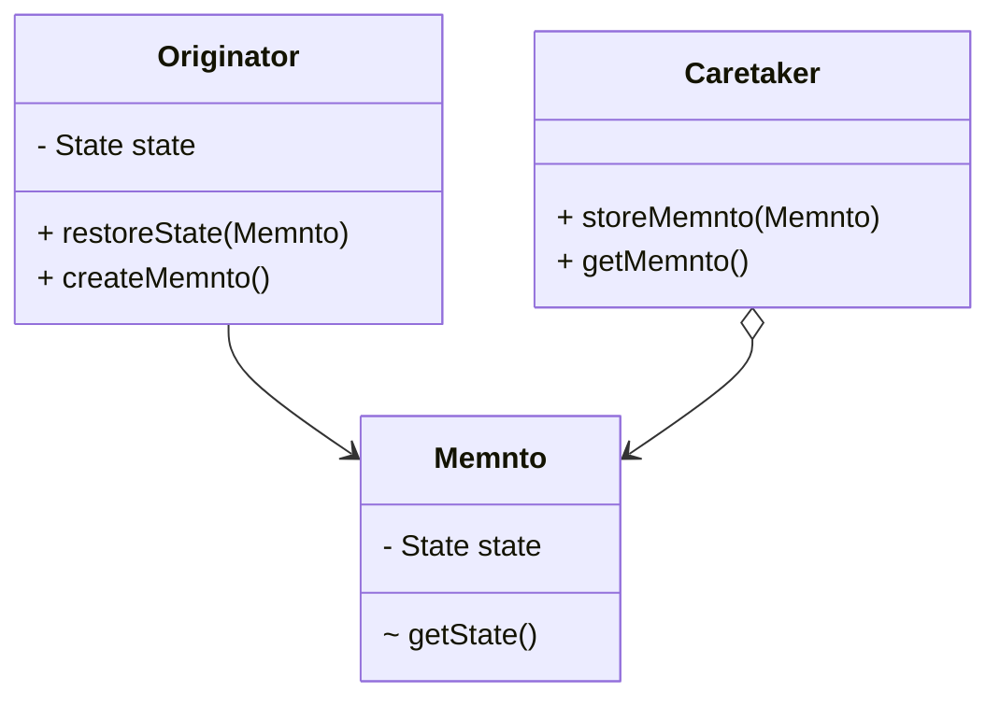

### 概述

备忘录模式属于行为模式，目的是保存和恢复内部状态，用于需要保存对象某一时刻的全部或部分状态，以便有需要时恢复到先前状态。适用场景：编辑－撤销、存档－恢复、数据库回滚。

### 认识备忘录模式
备忘录（Memnto）用于在不破坏对象封装的基础上，将目标对象内部的状态存储到外部对象中，以备之后恢复状态时使用。

备忘录模式中的角色：
- 发起人（Originator）：需要备份状态的对象，负责创建备忘录对象和使用备忘录对象恢复自身状态。
- 备忘录（Memnto）：用于保存状态数据。
- 备忘录管理员（Caretaker）：存储和管理备忘录。

<!-- more -->

### 优势与使用场景

### 代码实例

### 注意事项

### 参考资料

