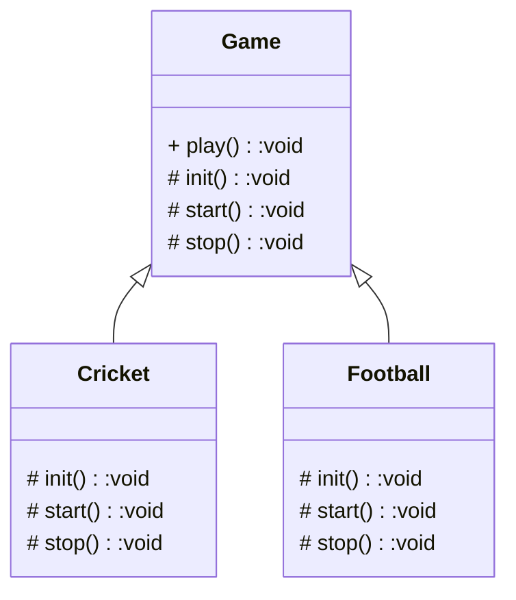

### 概述

这篇文章介绍了模板方法模式，这是一个很简单而应用广泛的设计模式，仅仅使用到类的继承机制。

### 关于模板方法模式

定义一个操作中的算法的框架，而将一些步骤延迟到子类中。使得子类可以不改变一个算法的结构即可重定义该算法的某些特定步骤。

模板方法模式，目的是减少重复代码，就是把固定不变的逻辑作为一个模板方法，放到父类中，其中的具体操作步骤由子类实现，来完成有差异的行为。

<!-- more -->

### 应用场景

- 有基本相同逻辑或算法的类
- 重要、复杂的算法，可以把核心算法设计成模板方法
- 重构时，可以使用模板方法模式，将相同代码抽取到父类中

### 优缺点

#### 优点

- 封装不变部分，扩展可变部分
- 提取公共部分代码，便于维护
- 行为由父类控制，子类实现

#### 缺点

子类的行为影响到了父类，与一般的设计习惯相反，让代码变得复杂，增加阅读难度。

### 代码示例

### 扩展

模板方法不能修改，当子类中的处理逻辑不同时，可以使用钩子方法来控制模板方法的逻辑。

### 注意事项

在模板方法模式中，基本方法由子类实现，基本方法一般使用 protected 修饰，由子类实现。模板方法调用基本方法完成固定的逻辑，**为了防止恶意操作，一般模板方法都使用 final 修饰，不允许被覆写**。可以有多个模板方法。

### 参考资料

- 程杰· 大话设计模式
- 秦小波· 设计模式之禅（第二版）

