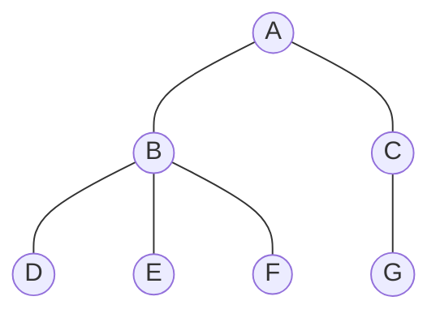
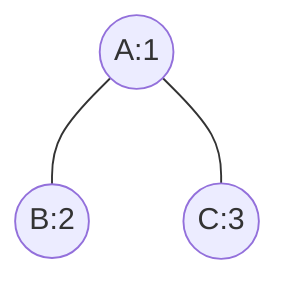

### 概述

在开发中很容易遇到树状结构的数据，比如公司管理层级、比如目录结构等等，当用关系型数据库存储这些数据时，如何设计存储结构以提高查询效率就是一个问题了。这篇文章介绍了使用闭包（Closure Table）表来存储树状结构数据。





### 闭包表

闭包表是一张记录树中所有节点以及节点之间的距离的关系表。使用闭包表能够轻松的查询结点的所有子孙节点、父节点，能够按距离查询。但闭包表的使用也会带来一些问题，因为闭包表中记录了所有节点之间的关系，所以在新增节点或修改节点时，都需要变更闭包表，要小心的维护这个表才能保证查询结果正确。

<!-- more -->


### 传统做法

在传统做法中，为了存储树状数据，需要在数据中增加字段指向其上级。如：

```java
class Employee {
    private Long id;
    private String name;
    private Long parentId; // 上级的 ID
}
```

这种方式很容易理解，很方便查找一个职员的直属上级和一个领导的直属下级。但也存在一些问题，当管理层级大于两级后就会比较麻烦，如查找一个领导的所有下属职员，或者查询一个员工的所有上级领导，一般需要使用递归来查询。


### 使用闭包表

使用闭包表后，实体中就可以不添加上级 id 了，但需要另一张表来存储节点关联信息。

- Employee.java

  ```java
  class Employee {
      private Long id;
      private String name;
  }
  ```

- EmployeePath.java

  ```java
  class EmployeePath {
      private Long ancestorId; // 祖先ID
      private Long descendantId; // 子孙ID
      private Integer deepth; // 节点深度
      private Boolean leaf; // 是否叶子节点
  }
  ```

在闭包表中，*ancestorId* 是上级 ID，*descendantId* 是下级 ID，*depth* 是上级到下级的层数，*leaf* 表示该节点是否是叶子节点。

数据示例：




