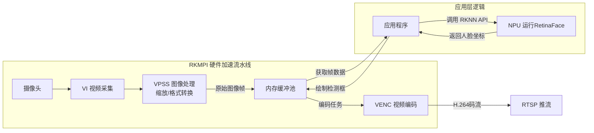

### 概述

这篇文章记录了使用 LuckFox Pico 开发板，搭配 SC3336 摄像头，实现人脸识别视频流播放。


### 原理

这里面用到了两大核心技术，使用 RKMPI 完成视频采集、处理、编码，使用 NPU 运行 RetinaFace 模型识别人脸位置：

- RKMPI ，全称是Rockchip Media Process Interface，它的核心价值就是**充分利用芯片中的硬件模块**（如VPU、ISP）来完成视频的捕获、处理和编码，数据无需经过CPU中转，大大提升了效率。RKMPI负责高效地“搬运”和处理视频数据，为NPU准备好每一帧图像。
- RetinaFace ，InsightFace 团队在 2019 年提出的单阶段人脸检测器，RetinaFace 模型在 NPU 上跑推理，精准地找出人脸位置。




<!-- more -->

### 物料

#### 设备

|        设备         | 操作系统  |            系统版本            |      IP       |                             备注                             |
| :-----------------: | :-------: | :----------------------------: | :-----------: | :----------------------------------------------------------: |
|         PC          |  Windows  |               11               | 192.168.2.176 |                        用于播放视频流                        |
| LuckFox Pico 开发板 | Buildroot | -g2ae728b52-dirty（2023.02.6） | 192.168.2.132 | 开发板，已经插入烧录Buildroot镜像的SD卡，通过Typ-C网卡接入局域网 |
|     Ubuntu主机      |  Ubuntu   |           24.04 LTS            | 192.168.2.190 |                     编译人脸识别项目代码                     |

#### 软件

|   软件    |  版本  |            用途            |                           下载地址                           |
| :-------: | :----: | :------------------------: | :----------------------------------------------------------: |
|    VLC    | 3.0.23 |  播放开发板的 rtsp 视频流  |             [VLC官网](https://www.videolan.org/)             |
| MobaXterm | v22.0  | 远程连接开发板与Ubuntu主机 | [MobaXterm_Portable_v22.0.zip](https://wiki.luckfox.com/Tools/MobaXterm_Portable_v22.0.zip) |

#### 其他物料

|         物料         |       参数        | 数量 |                       备注                       |
| :------------------: | :---------------: | :--: | :----------------------------------------------: |
|     SC3336摄像头     | 300万像素，带排线 |  1   |       型号：SC3336 3MP Camera (B) (带排线)       |
|        交换机        |     八孔千兆      |  1   |             让电脑、开发板接入局域网             |
| Type-C转网口有线网卡 |       百兆        |  1   |       插在开发板，为开发板提供有线联网功能       |
|     USB转TTL模块     |       CH340       |  1   |                通过串口访问开发板                |
|         网线         |        1米        |  1   |             连接Type-C 网卡到交换机              |
|        杜邦线        |   20cm，母对母    |  4   | 连接USB转TTL模块；连接电源和开发板，给开发板供电 |

### 播放视频流

> 参考官方使用说明文档，CSI 摄像头: <https://wiki.luckfox.com/zh/Luckfox-Pico-Plus-Mini/CSI-Camera> 

将 SC3336 摄像头排线插到开发板，确保排线的蓝色面朝向开发板。

查看是否识别到摄像头：

```bash
ls /userdata/
```

识别摄像头成功会输出 `rkipc.ini` 文件，例如：

```
ethaddr.txt  image.bmp    lost+found   rkipc.ini    video0       video1       video2
```


查看开发板 IP 地址，我的开发板 IP 是 `192.168.2.132`：

```
ip addr show
```


在 Windows 电脑上安装并打开 VLC 软件，点击菜单栏 `媒体` - `打开网络串流` ，输入网络地址 URL ：`rtsp://<开发板IP>/live/0`，如我的开发板 IP 是 `192.168.2.132`，所以输入URL 是 `rtsp://192.168.2.132/live/0` ，点击播放，即可看到通过摄像头拍到的视频。

 

视频效果：

 


> VLC软件默认会缓存1秒（1000ms=1s）的视频，可以适度减小缓存时间，可以提高实时性，但是延迟太低 可能导致丢包或者卡顿，建议不低于300ms。

 


### 人脸识别

> 以下项目编译均在 Ubuntu 主机上完成

#### 准备编译环境

下载 Buildroot 系统的交叉编译工具链：<https://files.luckfox.com/wiki/Luckfox-Pico/Software/arm-rockchip830-linux-uclibcgnueabihf.tar.gz> 

解压：

```bash
tar -zxf arm-rockchip830-linux-uclibcgnueabihf.tar.gz
```


记录下编译工具链目录中 bin 目录的绝对路径，添加到用户 bash 的环境变量：

```bash
vim ~/.bashrc
```


在配置最后面添加编译工具链 bin 路径：

```
export PATH=/home/wqf31415/tools/arm-rockchip830-linux-uclibcgnueabihf/bin:$PATH
```


更新环境变量，让配置立即生效：

```bash
source ~/.bashrc
```


打印编译工具链版本号，测试是否配置正确：

```bash
arm-rockchip830-linux-uclibcgnueabihf-gcc -v
```


#### 获取源码

从 gitee 仓库拉取官方 SDK 代码，将 SDK 目录记录下来：

```bash
git clone https://gitee.com/LuckfoxTECH/luckfox-pico.git
```


从 github 拉取人脸识别示例代码：

```bash
git clone https://github.com/LuckfoxTECH/luckfox_pico_rkmpi_example.git
```


#### 编译项目

进入示例项目目录：

```bash
cd luckfox_pico_rkmpi_example/
```


将 SDK 的路径设置为环境变量：

```bash
export LUCKFOX_SDK_PATH=/home/wqf31415/project/luckfox/luckfox-pico
```


给构建脚本添加可执行权限：

```bash
chmod a+x ./build.sh
```


执行编辑脚本：

```bash
./build.sh
```


提示选择 libc 库，我这里选择的 是 `uclibc` ，所以输入 `1` 回车

然后提示选择要编译的示例项目，选择人脸识别项目 `3) luckfox_pico_rtsp_retinaface` ，输入 `3` 回车，等待编译完成。


#### 运行程序

编译完成后的程序在 `install/uclibc/` 目录下，名为 `luckfox_pico_rtsp_retinaface_demo` 的目录，其中包含可执行程序，在其 `model` 目录下人脸识别模型文件 `retinaface.rknn` 。

将目录打包成 tar 包：

```bash
tar -cf luckfox_pico_rtsp_retinaface_demo.tar luckfox_pico_rtsp_retinaface_demo/
```


将 tar 包传输到开发板 的 /root 目录：

```bash
scp ./luckfox_pico_rtsp_retinaface_demo.tar root@192.168.2.132:/root
```


在 MobaXterm 软件中使用 ssh 登录开发板，进入 /root 目录，提取程序文件：

```bash
tar -xf luckfox_pico_rtsp_retinaface_demo.tar
```


关闭 Buildroot 自带的视频程序，释放对摄像头的占用：

```bash
RkLunch-stop.sh
```


进入项目目录，运行人脸识别程序：

```bash
cd luckfox_pico_rtsp_retinaface_demo
./luckfox_pico_rtsp_retinaface
```

 


#### 播放视频

在 Windows 电脑上使用 VLC 软件播放网络串流视频，地址还是 `rtsp://<开发板IP>/live/0` ，如我的是 `rtsp://192.168.2.132/live/0` ，点击播放，将摄像头朝向人脸，看到正确识别到了人脸。

 


### 扩展

官方示例使用了人脸识别的模型，我们可以自己训练一个图片识别模型，如车辆识别，训练后转换成 RKNN 格式，部署到开发板使用。


### 总结

- LuckFox Pico 带有 0.5 TOPS 的 神经网络处理器（NPU），和最大 30 帧的图像处理器（IPS），可以方便的实现人脸识别功能。
