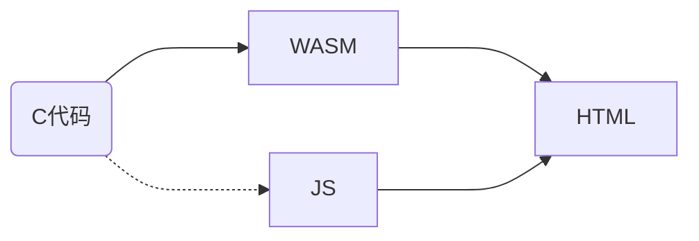
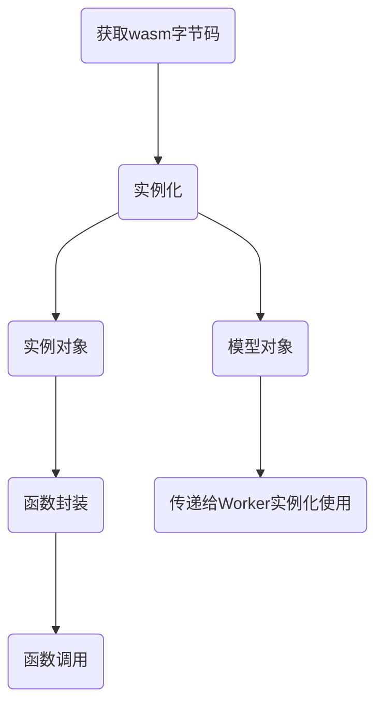

### 概述

这篇文章介绍了在 JavaScript 中通过 WebAssembly 调用 C 语言编写的函数，以及在 C 代码中调用 JavaScript 函数。


### web 使用 wasm 流程

在 web 项目中使用 WebAssembly 时，需要先编写 C 语言代码，然后使用 emscripten 编译成 `.wasm` 和 `.js` 文件，最后在 html 文件中引入 js 文件，就可以调用在 C 中定义的函数。在 wasm 中是无法操作 dom 的，需要结合 js 使用。



> 注意：使用 emscripten 自动生成的胶水 js 文件是对 wasm 的实例化和调用函数的封装，方便使用，这个 js 文件中对各种运行环境（node、shell、web、worker）做了支持，实际使用时可以根据自己的业务需求，排除不需要的代码以缩小 js 文件代码量，或自己编写封装成 js 文件。

<!-- more --> 

### WEB JS 中使用 WASM

目前在浏览器中还不支持直接使用 ES6 模块加载（将来会支持），使用 WebAssembly 的方式是从服务端获取 WebAssembly 字节码，然后使用 `WebAssembly.instantiateStreaming()` 或 `WebAssembly.instantiate()` 编译并实例化。




#### 编译和实例化的函数

- `WebAssembly.instantiateStreaming()` ：直接从流中编译和实例化，是一种更优的加载 wasm 代码方式。
- `WebAssembly.instantiate()` ：需要先将流转成 `ArrayBuffer` ，然后再使用此函数编译实例化 wasm。

#### 函数参数

`WebAssembly.instantiateStreaming(source, importObject)` 函数的参数：

- `source` 是一个 [`Response`](https://developer.mozilla.org/zh-CN/docs/Web/API/Response) 对象或一个 Promise （可以解析得到一个 `Response`）。
- `importObject` 要导入到最终 WebAssembly 实例中的值或函数，如 `WebAssembly.Memory` 对象。


`WebAssembly.instantiate()` 函数的参数：

第一个参数是：包含 wasm 二进制代码的类型数组(typed array)或数组缓冲区 (ArrayBuffer)；或一个 `WebAssembly.Module` 对象。

第二个参数与上面函数相同，是包含要导入到最终 WebAssembly 实例中的值或函数的对象。

#### 函数返回值

这两个函数的返回值是一样的，是一个 Promise，可以解析成一个 ResultObject，其中包含两个对象：

- `module` 编译完成的 WebAssembly 模块，可用于再次实例化或通过 `postMessage()` 与 Worker 共享。
- `instance` 一个 `WebAssembly.Instance` 实例对象，其中包含了导出的 WebAssembly 函数。

> 关于编译和实例化：
>
> 使用 `WebAssembly.compile()` 编译字节数组，使用 `new WebAssembly.Instance()` 实例化模块。
>
> ```js
> function instantiate(bytes, imports) {
>   return WebAssembly.compile(bytes)
>       .then(m => new WebAssembly.Instance(m, imports));
> }
> ```

#### 示例

示例一：使用 `fetch` 从服务端获取 `.wasm` ，使用 `arrayBuffer()` 将响应转换成 `ArrayBuffer` ，然后使用 `WebAssembly.instantiate()` 编译和实例化。

```js
fetch("example.wasm").then(response =>
    response.arrayBuffer()
).then(bytes =>
    WebAssembly.instantiate(bytes, importObject)
).then(result => {
    result.instance.exports._Z5sayHiv();
});
```


示例二：使用  `XMLHttpRequest` 从服务端获取 `.wasm` ，然后使用 `WebAssembly.instantiate()` 编译和实例化。

```js
request = new XMLHttpRequest();
request.open('GET', 'simple.wasm');
request.responseType = 'arraybuffer'; // 关键：指定响应类型为 ArrayBuffer
request.send();

request.onload = function() {
  var bytes = request.response;
  WebAssembly.instantiate(bytes, importObject).then(results => {
    results.instance.exports.exported_func();
  });
};
```


示例三：使用 `fetch` 从服务端获取 `.wasm` ，使用 `WebAssembly.instantiateStreaming()` 从响应流编译和实例化。

```js
WebAssembly.instantiateStreaming(fetch('simple.wasm'), importObject)
.then(obj => obj.instance.exports.exported_func());
```


#### 注意事项

在使用 `WebAssembly.instantiateStreaming()` 或 `WebAssembly.instantiate()` 编译并实例化 WebAssembly 时，第二个参数是一个对象，里面包含了要导入到 WebAssembly 实例的数据和函数。每个已编译模块的声明导入必须有一个匹配属性，否则抛出 [WebAssembly.LinkError ](https://developer.mozilla.org/en-US/docs/WebAssembly/JavaScript_interface/LinkError) 异常。


### JS 调用 C 函数

#### C 语言代码

> 在线示例: <a href="/example/wasm/interacting/jsCallCFunc.html" target="_blank">jsCallCFunc.html</a> 

在 C 语言代码中，首先需要包含 emscripten 的头文件 `emscripten.h` ，然后使用 `EMSCRIPTEN_KEEPALIVE` 宏来指明要导出的函数， 如果未使用 `EMSCRIPTEN_KEEPALIVE` 宏，在某些情况下会导致未被调用的函数被编译器优化掉。

`jsCallCFunc.c` 

```c
#include <stdio.h>
#include <emscripten.h>

EMSCRIPTEN_KEEPALIVE
void sayHi() {
  printf("Hi!\n");
}

EMSCRIPTEN_KEEPALIVE
int getInt() {
  return 99;
}

EMSCRIPTEN_KEEPALIVE
float add(float a, float b) {
  return a + b;
}

EMSCRIPTEN_KEEPALIVE
void greeting(char *name){
  printf("Hello, %s\n", name);
} 
```

> 在上述 C 代码中，定义了无参无返回值的函数、无参返回整数的函数、多个浮点型参数返回浮点型数据的函数、字符指针参数的函数。


#### 编译 wasm

编译命令（powershell）：

```powershell
emcc .\jsCallCFunc.c -o jsCallCFunc.html -sDEFAULT_LIBRARY_FUNCS_TO_INCLUDE=$stringToNewUTF8 -sEXPORTED_FUNCTIONS="_malloc,_free"
```

> 编译选项说明：
>
> - `DEFAULT_LIBRARY_FUNCS_TO_INCLUDE` 指定要导出的库函数，这里导出了函数 `stringToNewUTF8` ，用于在 JavaScript 中将字符串转换字节数组，用于将字符串擦书传递给 C 函数。
> - `EXPORTED_FUNCTIONS` : 要导出的函数，因为库函数 `stringToNewUTF8` 依赖函数 `malloc` 所以需要导出，导出时要在函数名前加下划线 `_` 。因为使用 `malloc` 函数分配内存后，需要使用 `free` 函数释放内存，所以需要同时导出 `free` 函数。


#### JS 中调用 C 函数：

将编译得到的 `.wasm` 、`.js` 、`.html` 文件放到 web 服务器中，使用浏览器访问，打开开发者工具并进入控制台，在控制台输入函数进行调用：

引入使用 emscripten 生成的 js 文件，可以使用 `Module._func（）` 或直接使用  `_func()`  来调用 c 中定义的函数。需要注意的是，对于字符串参数的传递方式，在 JavaScript 中，需要使用 `stringToNewUTF8` 函数将 js 字符串转成字节数组并获取其指针，然后通过传递指针的方式传参给 C 函数。

```javascript
Module._sayHi(); // 或 _sayHi();￥

Module._getInt(); // 或 _getInt();

Module._add(3, 2); // 或 _add(3, 2);

let name = stringToNewUTF8('world');
Module._greeting(name);
Module._free(name); // 注意字节数组用完成后要释放内存
```


#### 注意事项

在 C++ 中，为了防止编译 wasm 时导出的函数名不确定，需要使用 C 语言方式导出函数，建议添加宏来统一处理。

`wasm_common.h` 

```C
#ifndef __WASM_COMMON_H_
#define __WASM_COMMON_H_

#ifndef EM_PORT_API
#  if defined(__EMSCRIPTEN__)
#    include <emscripten.h>
#    if defined(__cplusplus)
#      define EM_PORT_API(rettype) extern "C" rettype EMSCRIPTEN_KEEPALIVE
#    else
#      define EM_PORT_API(rettype) rettype EMSCRIPTEN_KEEPALIVE
#    endif
#  else
#    if defined(_cplusplus)
#      define EM_PORT_API(rettype) extern "C" rettype
#    else
#      define EM_PORT_API(rettype) rerttype
#    endif
#  endif
#endif

#endif
```

> 代码说明：在上述代码中，通过 检查宏`__EMSCRIPTEN__` 判断是否 emscripten 环境，如果不是，就按普通 C/C++ 处理。
>
> 如果是 emscripten 环境，则包含 `emscripten.h` 头文件，并通过检查宏 `_cplusplus` 判断是否 C++ 环境，分辨定义宏 `EM_PORT_API` 的内容。


修改 C 语言代码，使用定义的宏 `EM_PORT_API`：

```C
#include <stdio.h>
#include "wasm_common.h"

EM_PORT_API(void) sayHi() {
  printf("Hi!\n");
}

EM_PORT_API(int) getInt() {
  return 99;
}

EM_PORT_API(float) add(float a, float b) {
  return a + b;
}

EM_PORT_API(void) greeting(char *name) {
  printf("Hello, %s\n", name);
} 
```


### C 调用 JS 函数

在 C 语言代码中可以直接使用 `emscripten_run_script()` 执行 JavaScript 代码，但这种方式是使用 `eval()` 将字符串转换成 js 代码后执行的，效率低。

更高效的方式是使用 `EM_JS()` 、`EM_ASM()` 等宏定义执行 js 代码，这种方式在编译执行时，直接将宏定义中的 js 代码加入到生成的代码中运行。

#### emscripten_run_script()

这是最直接的方式，但效率较低，底层是使用 `eval()` 函数将字符串转换成 JavaScript 代码后执行的。

```c
#include <stdio.h>
#include <emscripten.h>

int main(){
	emscripten_run_script("alert('hi')");
	return 0;
}
```


页面访问：

> 在线示例: <a href="/example/wasm/interacting/cCallJsFunc.html" target="_blank">cCallJsFunc.html</a> 

 


#### EM_JS()

`EM_JS()` 宏可以在 C 代码中定义一个调用 JavaScript 的函数。

```c
#include <stdio.h>
#include <emscripten.h>

EM_JS(void, call_alert, (), {
	alert('Hello world');
	throw 'all done';
});

int main(){
	call_alert();
	return 0;
}
```

> 注意：在 `EM_JS` 代码中使用的是单引号 `'` 定义的字符串，这是 JavaScript 的语法，在 C 语言中是不能用单引号定义字符串的。


访问页面，弹框显示 `Hello world` ，关闭弹框后，控制台输出 `Uncaught all done` 。

> 在线示例: <a href="/example/wasm/interacting/emJsDemo.html" target="_blank">emJsDemo.html</a> 


#### EM_ASM()

`EM_ASM()` 能够在 C 语言函数内部执行 JavaScript 代码。

```c
#include <stdio.h>
#include <emscripten.h>

int main(){
	EM_ASM({
		alert('Hello world');
		throw 'all done';
	});
	return 0;
}
```

访问页面，弹框显示 `Hello world` ，关闭弹框后，控制台输出 `Uncaught all done` 。

> 在线示例: <a href="/example/wasm/interacting/emAsmDemo.html" target="_blank">emAsmDemo.html</a> 


#### 注意事项

文章中的示例只涉及到部分 api，更多宏定义及用法，可参考官方文档：<https://emscripten.org/docs/api_reference/emscripten.h.html> 。


### 参考资料

- Interacting with code | Emscripten中文网: <https://emcc.zcopy.site/docs/porting/connecting_cpp_and_javascript/interacting-with-code/> 
- Interacting with code — Emscripten 3.1.42-git (dev) documentation: <https://emscripten.org/docs/porting/connecting_cpp_and_javascript/Interacting-with-code.html> 
- 丁尔男, 柴树杉. 《面向WebAssembly编程：应用开发方法与实践》. 机械工业出版社, 2021
- 加载和运行 WebAssembly 代码 - WebAssembly | MDN: <https://developer.mozilla.org/zh-CN/docs/WebAssembly/Loading_and_running> 

- webassembly介绍: <https://www.cnblogs.com/peter-web/p/16442856.html> 

- 编译 C/C++ 为 WebAssembly - WebAssembly | MDN: <https://developer.mozilla.org/zh-CN/docs/WebAssembly/C_to_Wasm> 


### 总结

在 WebAssembly 中灵活使用 JavaScript 与 C 语言的代码交互是使用 WebAssembly 的基础。
