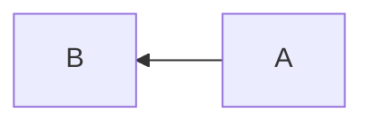
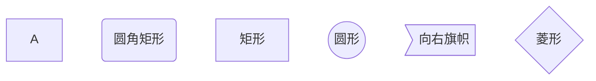
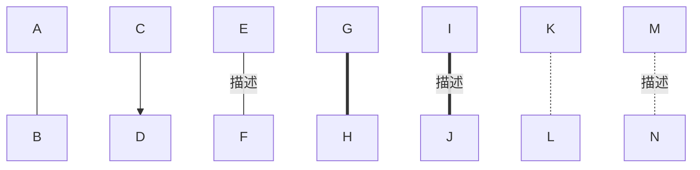
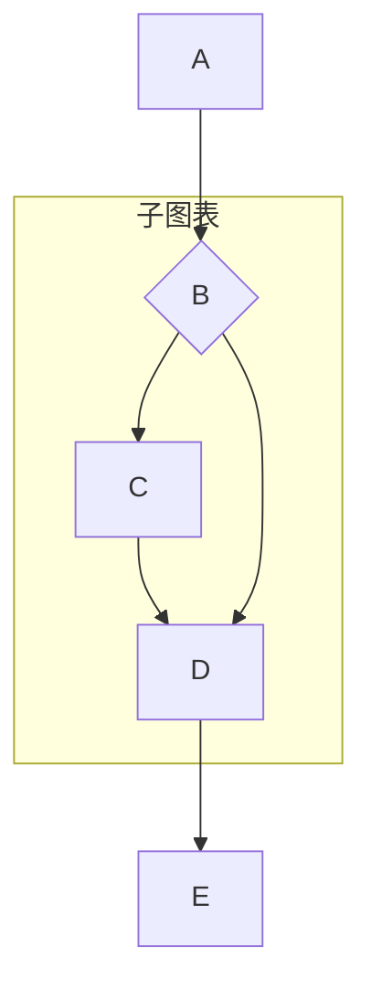
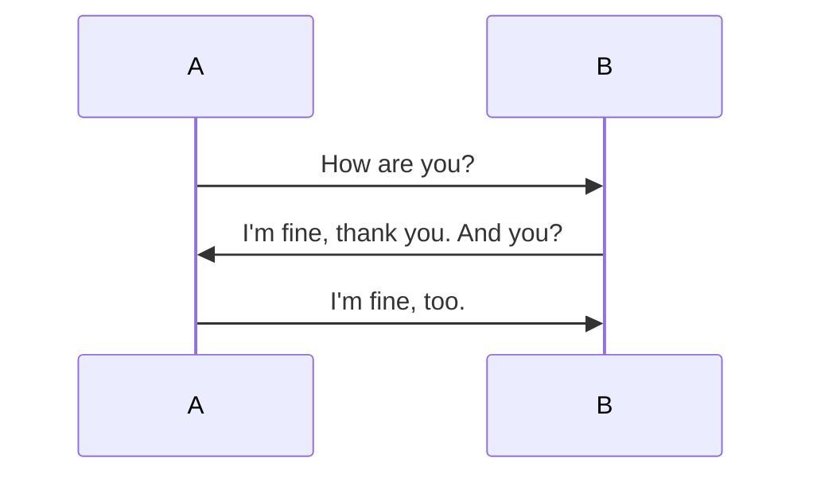
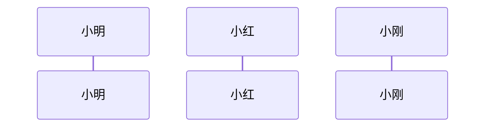
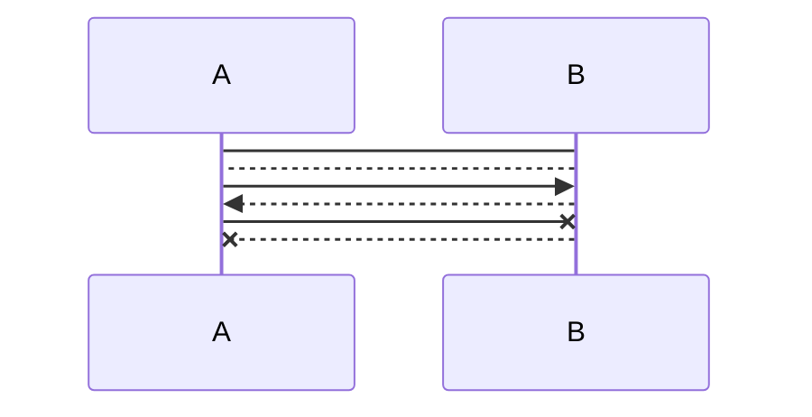
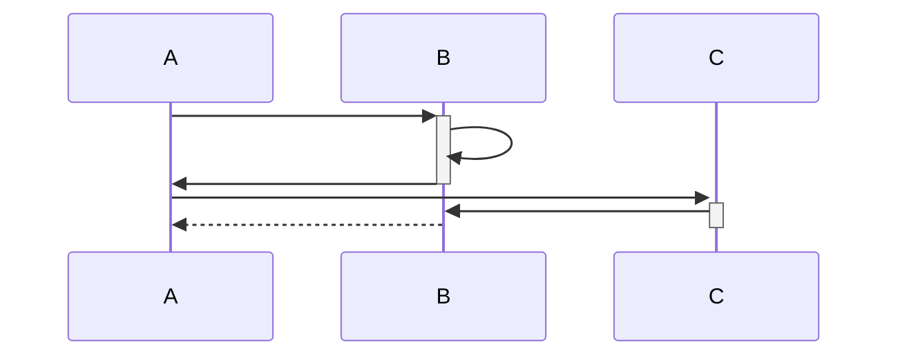

### 概述

mermaid 用于在 markdown 插入文档图，本文介绍了在 markdown 中使用 mermaid 插入图形的技巧。 


### 认识 mermaid 图

> mermaid github: <https://github.com/mermaid-js/mermaid> 

mermaid 美人鱼，是用文本语法来描述文档图形的工具，可以描述流程图、时序图、甘特图、类图等。在markdown 文档中可以使用 mermaid 文本插入文档图形，比如：


<!-- more -->


### mermaid 语法

#### 流程图 （Flow Chart）

流程图是用来展示程序执行流程的图，在 mermaid 中使用 `graph` 关键字声明，声明词需要放到第一行，后面需要指定图表方向。

##### 图表方向

Mermaid 图表支持多种方向的图形，在 mermaid 描述开始时，使用 `graph 方向描述词;` 规定图表方向，将决定图的走向，即箭头的默认方向。

方向描述：

| 方向描述词   | 含义                |
| ------------ | ------------------- |
| `TB` 或 `TD` | Top-Bottom 从上到下 |
| `BT`         | Bottom-Top 从下到上 |
| `LR`         | Left-Right 从左到右 |
| `RL`         | Right-Left 从右到左 |

举例：

```
graph RL;
A-->B
```

效果：



##### 节点定义

节点是指文档图中的文本块，比如在流程图中使用圆角矩形表示开始与结束，使用菱形表示条件判断，使用矩形表示流程。mermaid 中定义节点时，必须指定一个节点ID，ID 用于与其他节点创建连线，区分大小写。可以指定节点形状以及描述文字，节点形状缺省为矩形，描述文字缺省为节点ID，如 `start(开始)` 将创建一个圆角矩形的节点，显示内容为 `开始` ，节点ID 为 `start`。

| 语法         | 说明                     |
| ------------ | ------------------------ |
| `id[描述]`   | 矩形                     |
| `id(描述)`   | 圆角矩形                 |
| `id((描述))` | 圆形                     |
| `id>描述]`   | 向右旗帜（没有向左旗帜） |
| `id{描述}`   | 菱形                     |

> 如果节点描述中包含标点符号，需要使用双引号包裹，如要显示 `{{test}}` 需要写作 `id{"{{test}}"}` 。

举例：

```
graph TB;
A
start(圆角矩形)
process[矩形]
circle((圆形))
flag>向右旗帜]
judge{菱形}
```

效果：




##### 节点间的连线

两个节点 ID 中间加连线标识即可连接节点，如使用箭头连接 A 、B节点，写作 `A-->B` 。

| 连线标识                  | 说明                                                         |
| ------------------------- | ------------------------------------------------------------ |
| `>`                       | 加箭头，下面的所有连线都可以在最后面加上 `>` 来绘制带箭头的连线 |
| `-`                       | 不加箭头                                                     |
| `--`                      | 单线                                                         |
| `--描述--` 或 `---|描述|` | 带描述文字的单线                                             |
| `==`                      | 粗线                                                         |
| `==描述==`                | 带描述文字的粗线                                             |
| `-.-`                     | 虚线                                                         |
| `-.描述.-`                | 带描述文字的虚线                                             |

举例：

```
graph TB;
A---B
C-->D
E--描述---F
G===H
I==描述===J
K-.-L
M-.描述.-N

```

效果：



> 多个节点顺序连接时可以写成一条，如 `A-->B-->C-->D` 。


##### 子图表

子图表以 `subgraph 描述` 开始，以 `end` 结束，子图表区域会被单独框出来显示。

示例：

```
graph TB;
A --> B{B}
	subgraph 子图表
		B --> C
		C --> D
		B --> D
	end
D --> E
```




#### 序列图（Sequence Diagram）

序列图使用 `sequenceDiagram` 关键字声明，图形语法为 `[参与者1][消息线][参与者2]:消息体` ，如果没有消息体，需要输入空格，否则会报错。



##### 参与者

在序列图中可以使用 `participant` 来定义参与者。

```
sequenceDiagram
    participant 小明 
    participant 小红
    participant 小刚
```

效果



##### 消息线

| 语法   | 说明                       |
| ------ | -------------------------- |
| `->`   | 无箭头实线                 |
| `-->`  | 无箭头虚线                 |
| `->>`  | 有箭头实线                 |
| `-->>` | 有箭头虚线                 |
| `-x`   | 末端为叉的实线（表示异步） |
| `--x`  | 末端为叉的虚线（表示异步） |

示例：

```
sequenceDiagram
    A -> B : 
    B --> A : 
    A ->> B : 
    B -->> A : 
    A -x B : 
    B --x A : 
```




##### 处理中

在消息线末尾增加 `+` ，则消息接收者进入当前消息的处理中状态，

在消息线末尾增加 `-` ，则消息接收者离开当前消息处理中状态。

```
sequenceDiagram
    A ->>+ B : 
    B ->> B : 
    B ->>- A : 
    A ->>+ C : 
    C ->>- B :  
    B -->> A : 
```




##### 标注

使用 `Note 位置 参与者 : 标注文字` 来添加标注，位置可以是：

| 标注位置 | 含义 |
| -------- | ---- |
|          |      |
|          |      |
|          |      |


##### 循环


##### 判断


#### 甘特图（Gantt）


#### 类图（Class Diagram）


#### 饼图（Pie Chart）


#### 状态图（State Diagram）


#### 用户旅程图（User Journey Diagram）


### 支持 mermaid 的编辑器及平台

经典的 markdown 文档编辑器 typora 已经支持 mermaid 图，支持实时预览，当语法出错时还能给予错误提示。

CSDN 博客文章也是用 markdown 语法编辑的，其中也支持 mermaid。


### 在 hexo 博客中使用 mermaid

在 hexo 中使用 mermaid 需要添加 Hexo 的 mermaid 过滤器 `hexo-filter-mermaid-diagrams` ，可以使用 yarn 或 npm 安装：

- yarn: `yarn add hexo-filter-mermaid-diagrams` 
- npm: `npm install hexo-filter-mermaid-diagrams` 

然后需要根据使用的主题修改配置与模板文件，我使用的是 next 主题，最新版的 next 主题不需要修改配置，直接部署即可支持 mermaid 。


### 参考资料

- Mermaid 实用教程: <https://blog.csdn.net/fenghuizhidao/article/details/79440583> 0
- Markdown里面使用mermaid画流程图: <https://blog.csdn.net/Subson/article/details/78054689> 
- 如何在Markdown中画流程图: <https://www.jianshu.com/p/b421cc723da5> 
- Hexo中插入mermaid diagrams : <https://blog.csdn.net/Olivia_Vang/article/details/92987859> 
- Hexo中引入Mermaid流程图: <https://tyloafer.github.io/posts/7790/> 


### 总结

在文档中，图形的表现力要远大于文字，在平时用 markdown 写文档的时候，可以采用 mermaid 插入图形，让表述更加准确易读。