### 概述

mermaid 用于在 markdown 插入文档图，本文介绍了在 markdown 中使用 mermaid 插入图形的技巧。 


### 认识 mermaid 图

> mermaid github: <https://github.com/mermaid-js/mermaid> 

mermaid 美人鱼，是用文本语法来描述文档图形的工具，可以描述流程图、时序图、甘特图、类图等。在markdown 文档中可以使用 mermaid 文本插入文档图形，比如：


<!-- more -->


### mermaid 语法

下面列举了常用的绘制 mermaid 图形的语法，更多语法请参考官方文档： <https://mermaid-js.github.io/mermaid/> 

#### 流程图 （Flow Chart）

流程图是用来展示程序执行流程的图，在 mermaid 中使用 `graph` 关键字声明，声明词需要放到第一行，后面需要指定图表方向。

##### 图表方向

Mermaid 图表支持多种方向的图形，在 mermaid 描述开始时，使用 `graph 方向描述词;` 规定图表方向，将决定图的走向，即箭头的默认方向。

方向描述：

| 方向描述词   | 含义                |
| ------------ | ------------------- |
| `TB` 或 `TD` | Top-Bottom 从上到下 |
| `BT`         | Bottom-Top 从下到上 |
| `LR`         | Left-Right 从左到右 |
| `RL`         | Right-Left 从右到左 |

举例：

```
graph RL;
A-->B
```

效果：

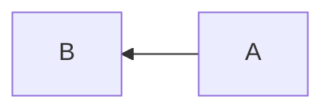

##### 节点定义

节点是指文档图中的文本块，比如在流程图中使用圆角矩形表示开始与结束，使用菱形表示条件判断，使用矩形表示流程。mermaid 中定义节点时，必须指定一个节点ID，ID 用于与其他节点创建连线，区分大小写。可以指定节点形状以及描述文字，节点形状缺省为矩形，描述文字缺省为节点ID，如 `start(开始)` 将创建一个圆角矩形的节点，显示内容为 `开始` ，节点ID 为 `start`。

| 语法         | 说明                     |
| ------------ | ------------------------ |
| `id[描述]`   | 矩形                     |
| `id(描述)`   | 圆角矩形                 |
| `id((描述))` | 圆形                     |
| `id>描述]`   | 向右旗帜（没有向左旗帜） |
| `id{描述}`   | 菱形                     |

> 如果节点描述中包含标点符号，需要使用双引号包裹，如要显示 `{{test}}` 需要写作 `id{"{{test}}"}` 。

举例：

```
graph TB;
A --- start(圆角矩形)
process[矩形] --- circle((圆形))
flag>向右旗帜] --- judge{菱形}
stadium-shaped([xxx]) --- subroutine[[yyy]]
database[(database)] --- hexagon{{六边形}}
parallelogram[/平行四边形/] --- parallelogram-alt[\平行四边形\]
trapezoid[/梯形\] --- trapezoid-alt[\倒梯形/]
```

效果：

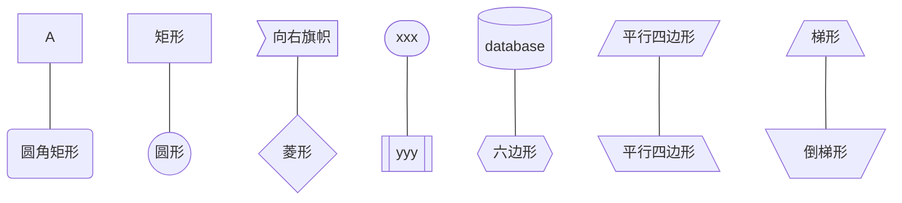


##### 节点间的连线

两个节点 ID 中间加连线标识即可连接节点，如使用箭头连接 A 、B节点，写作 `A --> B` 。

举例：

```
graph TB;
A --- B -- 描述 --- C ---|描述| D
a --> b -- 描述 --> c 
E === F == 描述 === G ===|描述| H
e ==> f == 描述 ==> g
I -.- J -. 描述 .- K .-|描述| L
i -.-> j -. 描述 .-> k

```

效果：

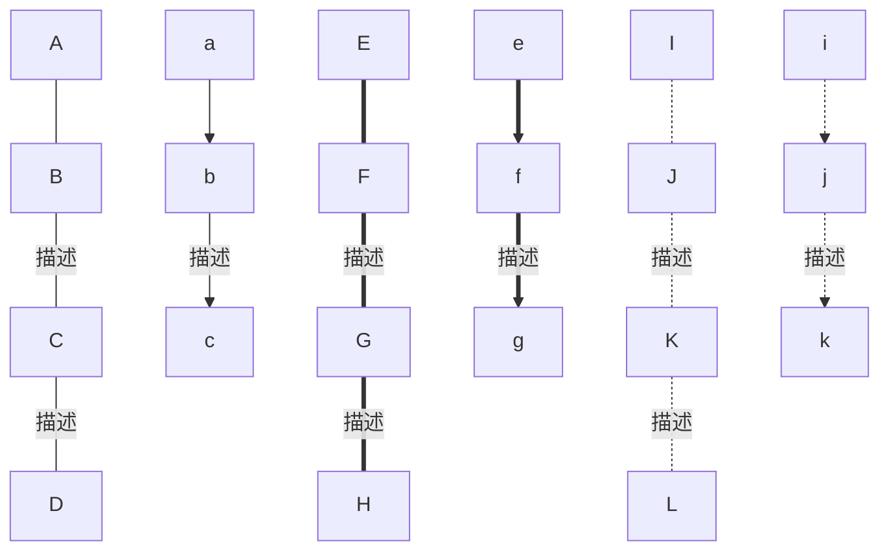

> 多个节点顺序连接时可以写成一条，如 `A-->B-->C-->D` ，多个节点可以使用 `&` 连接，如 `A --> B & C --> D` ，或 `A & B --> C` 。


##### 子图表

子图表以 `subgraph 描述` 开始，以 `end` 结束，子图表区域会被单独框出来显示。

示例：

```
graph TB;
A --> B{B}
	subgraph 子图表
		B --> C
		B & C --> D
	end
D --> E
```

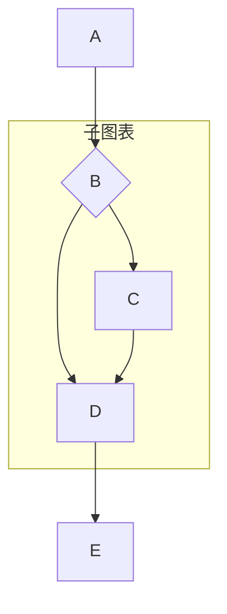


#### 序列图（Sequence Diagram）

序列图使用 `sequenceDiagram` 关键字声明，图形语法为 `[参与者1][消息线][参与者2]:消息体` ，如果没有消息体，需要输入空格，否则会报错。

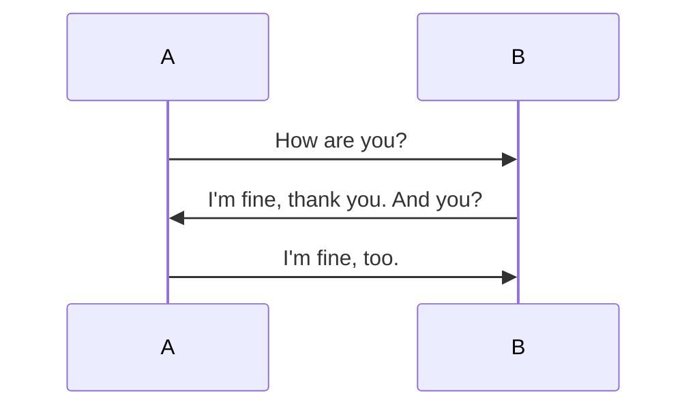

##### 参与者

在序列图中可以使用 `participant 参与者` 来定义参与者，可以为参与者添加别名，如  `participant A as participantA` ，关键字 `patticipant` 和 `as` 不区分大小写。

```
sequenceDiagram
    participant m as 小明 
    Participant h As 小红
    PARTICIPANT g AS 小刚
    m ->> h : hi
    h ->> g : hi
    g ->> m : hi
```

效果

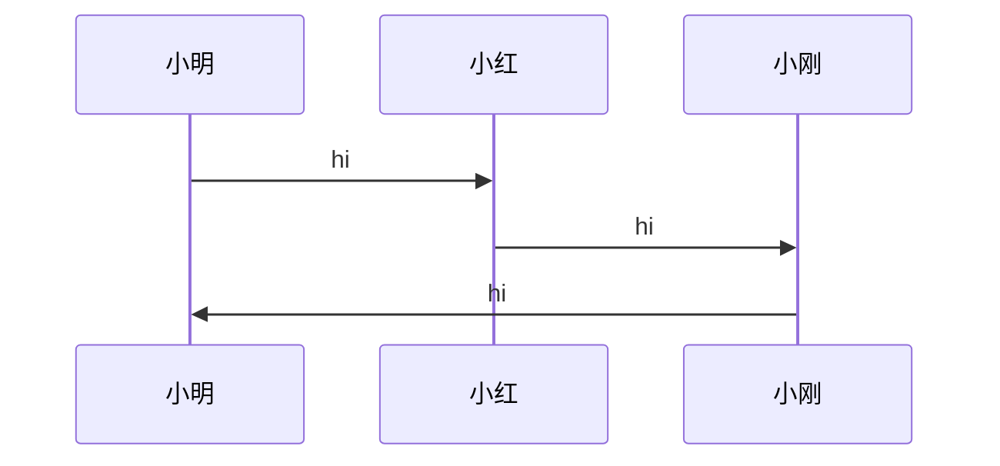

##### 消息线

| 语法   | 说明                       |
| ------ | -------------------------- |
| `->`   | 无箭头实线                 |
| `-->`  | 无箭头虚线                 |
| `->>`  | 有箭头实线                 |
| `-->>` | 有箭头虚线                 |
| `-x`   | 末端为叉的实线（表示异步） |
| `--x`  | 末端为叉的虚线（表示异步） |

示例：

```
sequenceDiagram
    A -> B : 
    B --> A : 
    A ->> B : 
    B -->> A : 
    A -x B : 
    B --x A : 
```


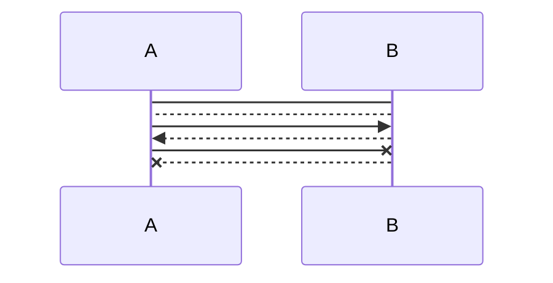

##### 处理中

在消息线末尾增加 `+` ，则消息接收者进入当前消息的处理中状态，在消息线末尾增加 `-` ，则消息接收者离开当前消息处理中状态。

或者使用 `activate 参与者` 指定参与者处于处理状态，使用 `deactivate 参与者` 指定参与者离开处理状态  。注意 `activate` 和 `deactivate` 必须成对出现，否则会报错。

示例：

```
sequenceDiagram
    A ->>+ B : 
    B ->> B : 
    B ->>- A : 
    A ->> C : 
    activate C
    C ->> B : 
    activate B
    deactivate C
    B -->> A : 
    deactivate B
```


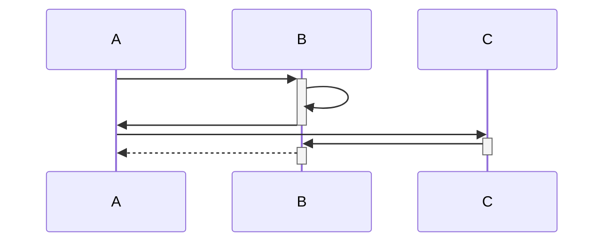

##### 标注

使用 `Note 位置 参与者 : 标注文字` 来添加标注，位置可以是：

| 标注位置                   | 含义 |
| -------------------------- | ---- |
| `right of 参与者`          | 右侧 |
| `left of 参与者`           | 左侧 |
| `over 参与者1,参与者2... ` | 横跨 |

示例：

```
sequenceDiagram;
	participant a AS 小明
	participant b AS 小花 
	a ->> b : hi
	Note right of b : b右侧
	note left of a : a左侧
	b ->> a : hi
	note over a,b : 横跨ab
	note over a : 横跨a
```

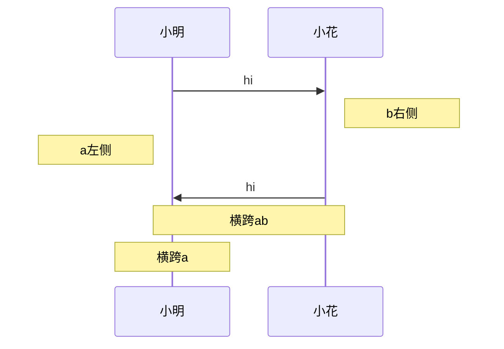


##### 循环

使用 `loop 描述` 在序列图中添加循环， 使用 `end` 标记循环结束。

示例

```
sequenceDiagram;
  participant a as 小明
  participant b as 小花
  a ->> b : hi
  loop 循环
  	b ->> a : hi
  end
```

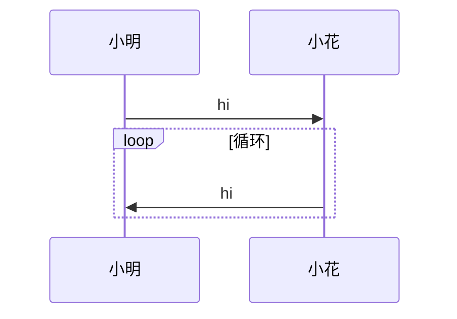


##### 判断

使用 `alt 描述` 添加满足条件判断分支，使用 `else 描述` 添加不满足的分支，可以添加多个 else 分支，使用 `end` 结束条件判断。当没有 else 分支时，使用 `opt 描述` 和 `end` 来添加可选条件。

示例：

```
sequenceDiagram;
    participant a As 小明
    participant b As 小花
    a ->> b : 能做我女票吗？
    alt 同意
        b ->> a: 好啊
    else 不同意
        b ->> a: 你是个好人
    end
    opt 其他消息
        b ->> a: 你好吗
    end
```

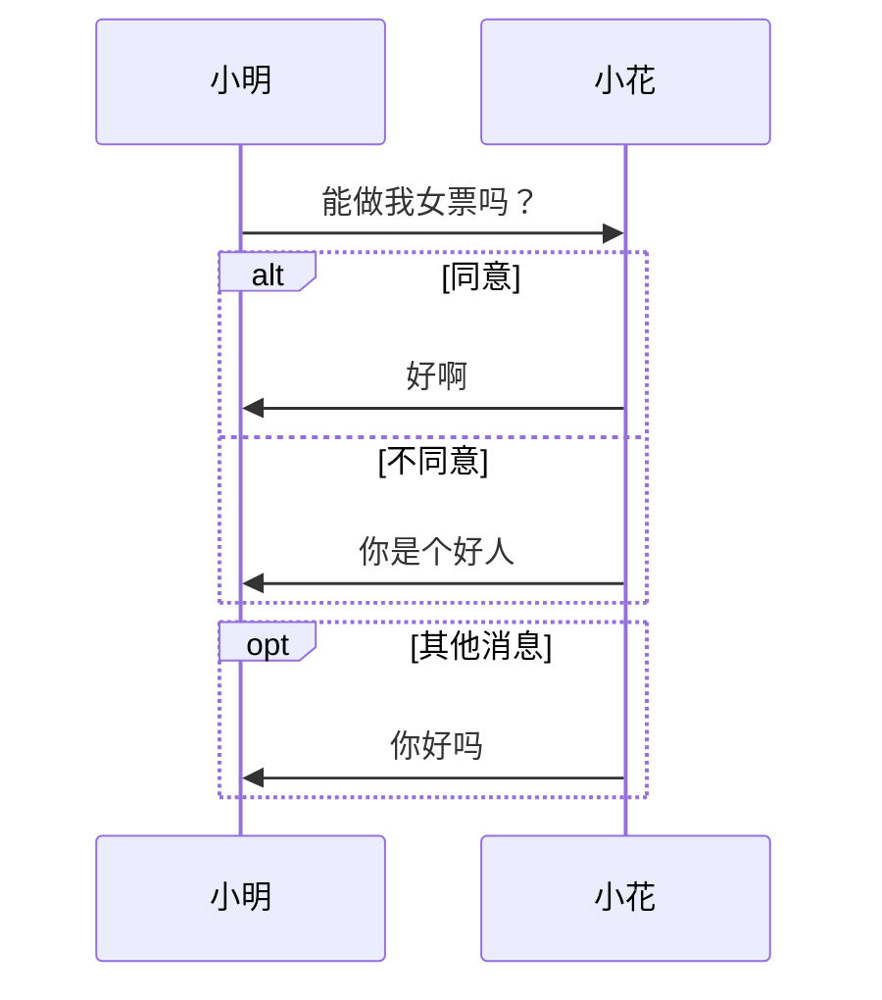


#### 甘特图（Gantt）

甘特图中通过条状图形来显示项目进度，在 mermaid 中使用 `gantt` 来标识甘特图。

```
gantt
    title 项目进度
    dateFormat YYYY-MM-DD
    section 需求分析
        初步了解 : done,a1,2020-01-01,2d
        深入了解 :done,a2,after a1, 5d
        确认需求 :done,after a2,2d
    section 概要设计
        组织模块划分 : done,b1,2020-01-10,2d
        功能接口设计 : active,b2,after b1,3d
        数据接口设计 : 3d
        出错设计 : 2d
```

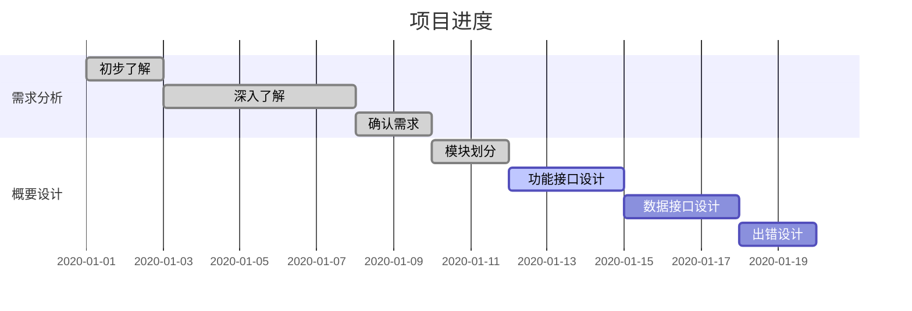

##### 语法解析

- `title` 定义甘特图标题
- `dateFormat` 指定时间格式
- `section` 项目阶段
- 任务项：`任务描述 : [状态],[任务id],[开始时间],[消耗时间]` ，其中：
  - [状态] 表示任务当前状态，可省略，状态值包括：`active` 激活状态、`done` 完成状态
  - [任务id] 是为当前任务项定义的 id，方便引用，可省略
  - [开始时间] 是任务开始执行的时间，可省略，省略时表示上一个任务完成后开始。可以指定具体时间，如 `2020-01-01` ，或者是 `after 任务ID` 指定在指定任务完成后开始
  - [消耗时间] 表示任务消耗时间，如耗时 5 天，写作 `5d`  


#### 类图（Class Diagram）

```
classDiagram
    Client --> AbstractFactory
    Client --> AbstractProduct
    AbstractFactory <|-- ConcreteFactory
    AbstractProduct <|-- ConcreteProduct
    class AbstractFactory{
        +createProduct()
    }
```

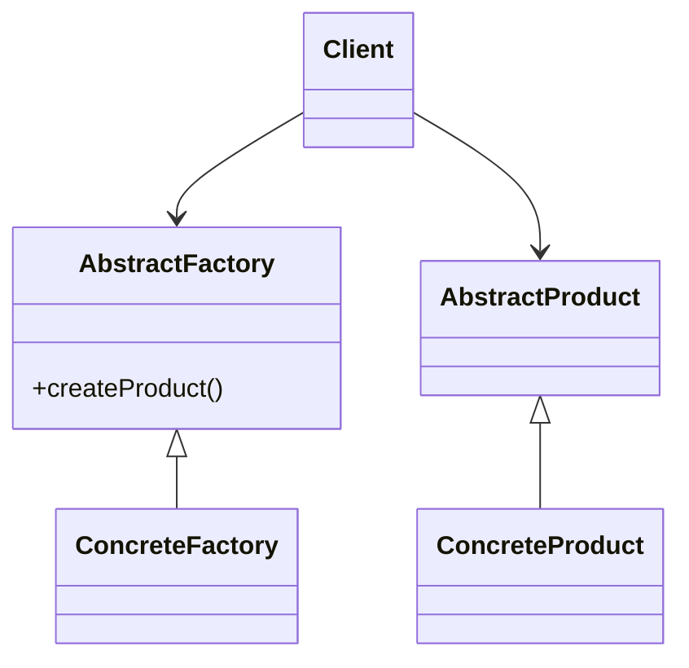


#### 饼图（Pie Chart）

mermaid 中使用 `pie` 标识饼图，可以使用 `title` 指定图名。

```
pie
    title 我的周末
    "睡觉": 16
    "玩手机": 32
```

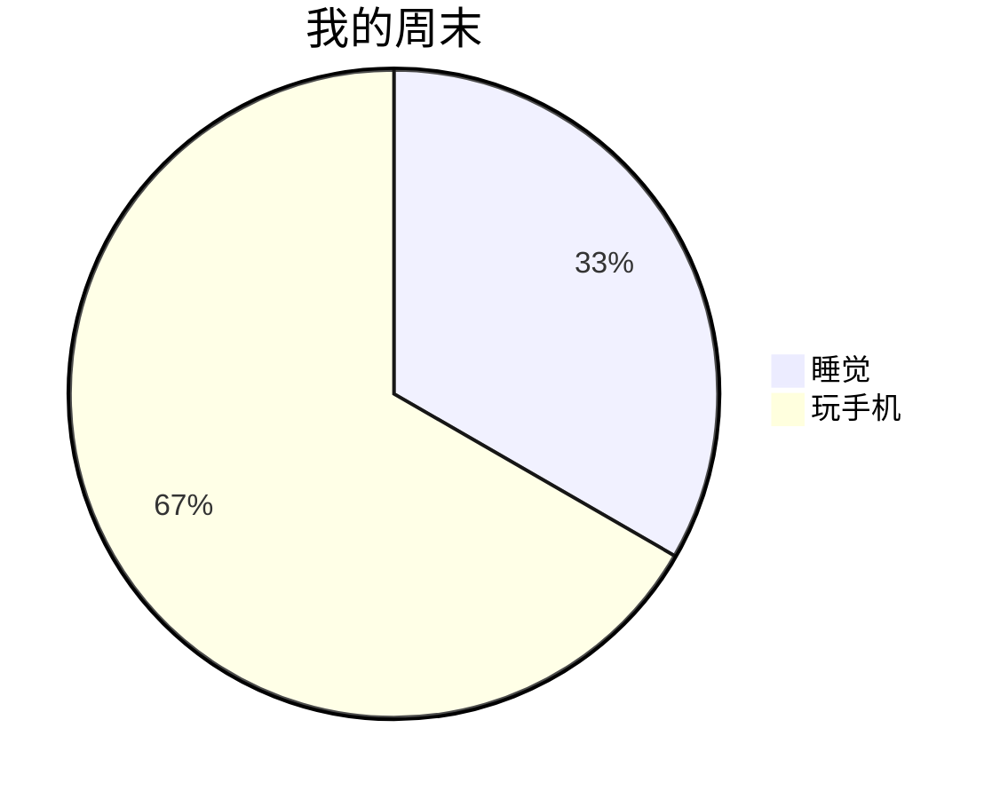


#### 状态图（State Diagram）

```
stateDiagram-v2
    [*] --> still
    still --> [*]
    still --> moving
    moving --> crash
    crash --> [*]
```

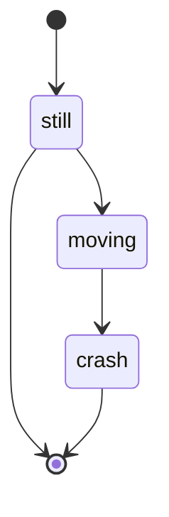


#### 用户旅程图（User Journey Diagram）

用户旅程将一系列用户目标合操作放到时间轴中，并加入用户的思想和情感，为产品设计过程提供用户需求信息。用户旅程图结合了讲故事和可视化两大工具，可以帮助团队成员理解用户需求以及用户使用产品解决痛点的整个过程。

```
journey
    title My working day
    section Go to work
      Make tea: 5: Me
      Go upstairs: 3: Me
      Do work: 1: Me, Cat
    section Go home
      Go downstairs: 5: Me
      Sit down: 5: Me
```

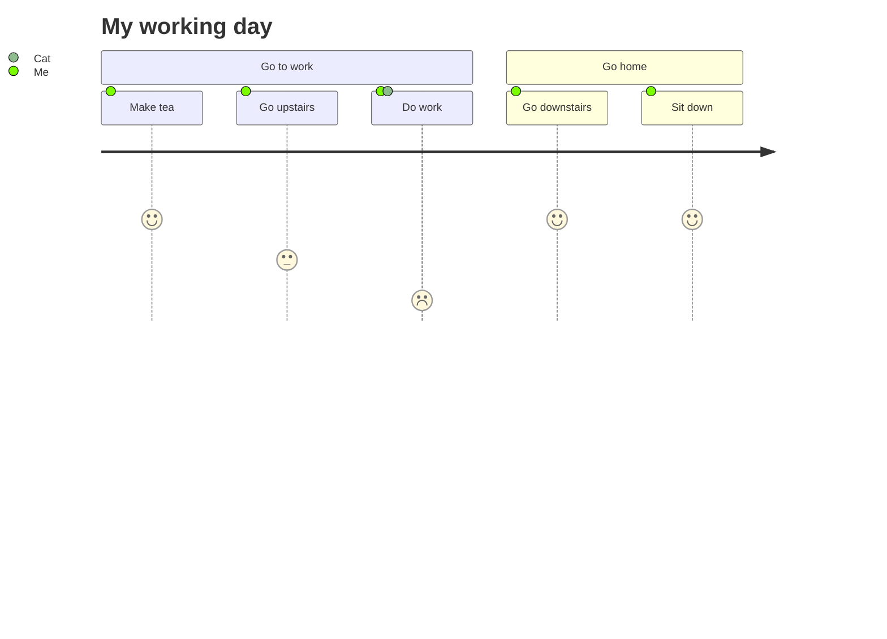


### 支持 mermaid 的编辑器及平台

经典的 markdown 文档编辑器 typora 已经支持 mermaid 图，支持实时预览，当语法出错时还能给予错误提示。

CSDN 博客文章也是用 markdown 语法编辑的，其中也支持 mermaid。


### 在 hexo 博客中使用 mermaid

在 hexo 中使用 mermaid 需要添加 Hexo 的 mermaid 过滤器 `hexo-filter-mermaid-diagrams` ，可以使用 yarn 或 npm 安装：

- yarn: `yarn add hexo-filter-mermaid-diagrams` 
- npm: `npm install hexo-filter-mermaid-diagrams` 

然后需要根据使用的主题修改配置与模板文件，我使用的是 next 主题，最新版的 next 主题不需要修改配置，直接部署即可支持 mermaid 。


### 参考资料

- Mermaid 实用教程: <https://blog.csdn.net/fenghuizhidao/article/details/79440583> 
- Markdown里面使用mermaid画流程图: <https://blog.csdn.net/Subson/article/details/78054689> 
- 如何在Markdown中画流程图: <https://www.jianshu.com/p/b421cc723da5> 
- Hexo中插入mermaid diagrams : <https://blog.csdn.net/Olivia_Vang/article/details/92987859> 
- Hexo中引入Mermaid流程图: <https://tyloafer.github.io/posts/7790/> 
- 什么时候以及怎样创建用户旅程图 : <https://zhuanlan.zhihu.com/p/100517337> 


### 总结

在文档中，图形的表现力要远大于文字，在平时用 markdown 写文档的时候，可以采用 mermaid 插入图形，让表述更加准确易读。