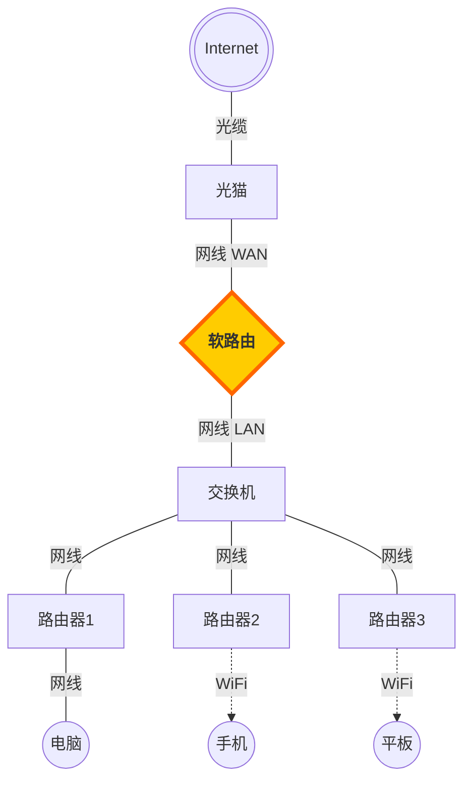

### 概述

这篇文件记录了使用友善 R3S 安装 ImmortalWrt 系统，搭建家庭软路由的安装配置过程。

### 组网

友善 NanoPi R3S （后简称R3S）搭载瑞芯微 RK3566 处理器，板载2G LPDDR4X 内存，支持 MicroSD，接口包含 1 个USB 3.0 Type-A接口，1个Type-C（5V2A）供电接口，2个千兆网口，适合当作软路由使用。设备原装了友善 FriendlyWrt 系统，这次我用来运行 ImmortalWrt 系统，搭建家庭网络软路由。

<!-- more -->

### 物料

以下是关键物料：

| 名称            | 关键参数          | 来源           | 备注                               |
| --------------- | ----------------- | -------------- | ---------------------------------- |
| 友善 NanoPi R3S | 2G 内存，32G eMMC | 购于淘宝       | 实际eMMC没用上，可以买不带eMMC版本 |
| 光猫            | -                 | 网络运营商提供 | -                                  |
| 交换机          | 八孔千兆          | 购于京东       | -                                  |
| 路由器          | -                 | 网络运营商提供 | 路由器设置成了桥接模式             |
| 笔记本电脑      | Windows 11系统    | -              | 用于连接软路由进行配置             |
| 网线            | 超六类，1米       | 购于京东       | -                                  |
| TF卡            | 32G               | 购于淘宝       | 购买时附送了读卡器                 |

### 烧录系统

#### 下载系统镜像

> 适用于 R3S 的 ImmortalWrt 24.10.5 版本下载页面链接：<https://firmware-selector.immortalwrt.org/?version=24.10.5&target=rockchip%2Farmv8&id=friendlyarm_nanopi-r3s>  

进入 ImmortalWrt 的固件下载网站 <https://firmware-selector.immortalwrt.org/> 

搜索型号：`FriendlyARM NanoPi R3S` 

版本选择最新的稳定版本，现在最新的是：`24.10.5` 

选择完成后，页面显示可下载的镜像，点击按钮下载。

> 网站提供构建镜像功能，可以指定预装的软件包和启动脚本，在启动脚本中可以设置系统用户密码、ip地址等信息。

**注意**：页面提供两种格式的镜像，分别是 `EXT4` 和 `SQUASHFS` ，指的是两种不同的**根文件系统格式**，它们最核心的区别在于：**`squashfs` 是只读的，而 `ext4` 是可读写的**。我选择的是 `EXT4` 的，因为我后续可能会装 docker 容器， `EXT4` 可以让我更方便地管理磁盘空间。

| 特性对比     | SQUASHFS格式                                                 | EXT4格式                                                     |
| ------------ | ------------------------------------------------------------ | ------------------------------------------------------------ |
| **核心特性** | **高强度压缩，只读型**的文件系统。                           | Linux 系统标准的、**可读写**的日志型文件系统。               |
| **工作原理** | 固件本身是只读的，所有系统修改（如安装软件、更改配置）都保存在一个独立的、可读写的 **overlay 分区**中。 | 整个根分区都是可读写的，对系统的任何修改都直接写入分区。     |
| **优势**     | 1. **“恢复出厂设置”功能**：这是它最大的优点。当系统出错时，只需清除 overlay 分区，就能回到纯净的初始状态。 2. **节省空间**：固件镜像体积小，占用闪存空间少。 | 1. **空间利用率高**：能充分利用存储介质（如硬盘、U盘、存储卡）的全部剩余空间。 2. **灵活性高**：对熟悉 Linux 的用户来说，管理和修改文件系统更直接。 |
| **劣势**     | **空间管理复杂**：固件空间和可用空间是分开的，容易遇到“系统分区满，但存储空间没用上”的情况，需要手动扩容。 | **无法“恢复出厂设置”**：一旦系统配置损坏或操作失误，无法通过简单的恢复操作还原，可能需要重刷整个固件。 |
| **适用场景** | 1. **新手**，或者希望系统有个“后悔药”，折腾坏了能轻松恢复。2. 你的设备**存储空间非常有限**（例如一些老旧的、只有16/32MB闪存的路由器），`squashfs` 的压缩特性可以有效节省空间。3. 希望系统核心文件保持绝对干净和安全，不易被意外修改或病毒感染 | 1. 计划在路由器上运行**需要大量读写的应用**，比如 `docker` 容器服务、下载工具等，`ext4` 可以让你更方便地管理磁盘空间。2. 习惯于像操作普通Linux服务器一样直接管理文件系统，希望所有空间都一览无余，分区管理更直接。3. 设备存储空间**非常充裕**（比如用大容量U盘或硬盘运行的软路由），不在意固件镜像的体积差异。 |

#### 烧录镜像到TF卡

将 TF 卡连接到电脑，打开 balenaEtcher 软件，选择下载的镜像文件，烧录目标设备选择插入的 TF 卡，点击开始烧录，等待约 1 分钟烧录完成。

> balenaEtcher是一款用于烧录操作系统到 SD 卡或 USB 设备的软件，下载地址是: <https://etcher.balena.io/>

### 配置网络

将烧录了 ImmortalWrt 系统的内存卡插入友善 R3S 的 TF 卡插槽，用网线把 R3S 的 wan 口连接到光猫，R3S 的 lan 口连接到交换机，交换机连接到路由器。

给 R3S 上电，电源指示灯先快速闪动，最后常亮，说明系统启动完成。此时看 wan、lan 指示灯亮起。

电脑连接到路由器或交换机，等待电脑获取到 IP ，查看电脑 IP，发现是 `192.168.1.*` 的网段。

打开浏览器访问 R3S 的管理页面：<http://192.168.1.1> 。

系统默认用户是 root，没有密码，输入用户名后直接登录，登录后页面提示要修改密码。

进入管理页面的 `网络` --> `接口` 页面，看到 lan 口的 IPv4 地址是 `192.168.1.1/24` ，和 wan 口 IP 是同一个段，需要修改。

点击编辑，将 IPv4地址修改为：`192.168.2.1` ，IPv4 广播地址自动更新为：`192.168.2.255` ，点击保存。

界面显示接口有3个未应用的修改，点击它，再点击 `保存并应用` ，弹出的提示框中再次点击确认。

这时网络连接会中断，等待一段时间后（可能需要重启路由器），电脑显示联网成功，重新获取到了 IP，查看IP 已经是 `192.168.2.*` 的网段了，此时可以访问 <http://192.168.2.1> 进入软路由管理页面。

### 安装程序

安装程序的方式有两种：

- 一是通过 ssh 访问软路由，如 `ssh root@192.168.2.1` ，在命令行窗口通过包管理工具 opkg 进行安装，如 `opkg install luci-i18n-passwall-zh-cn` ；
- 二是在软路由管理界面的 `系统` --> `软件包` 界面搜索软件包，点击安装。

**注意**：在安装软件包之前需要更新 opkg，可以执行命令 `opkg update` 或在软件包管理界面点击 `更新列表` 。

下面是要安装的一些软件：

| 序号 |          软件包          |    功能    |           备注           |
| :--: | :----------------------: | :--------: | :----------------------: |
|  1   |   luci-i18n-ttyd-zh-cn   | 命令行工具 |           可选           |
|  2   |     luci-theme-argon     |    主题    | 建议安装，比原始主题好看 |
|  3   | luci-i18n-passwall-zh-cn |  代理工具  |         建议安装         |
|  4   |    luci-app-openclash    |  代理工具  |           可选           |

### 科学上网

安装上网代理工具 `luci-i18n-passwall-zh-cn` 后，重新登录软路由管理页面，进入 `服务` --> `PassWall` 页面。

在 `节点订阅` 选项卡中点击 `添加` ，填写机场备注、订阅地址（使用 V2Ray 订阅链接），其他选项可以保持默认，点击保存并应用，保存后可以看到已添加的订阅信息。

在 `节点订阅` 页面点击手动订阅后，进入 `节点列表` 选项卡，看到已经获取到的代理节点，根据需要选择合适、速度快的节点，点击后面的`使用` 按钮，在确认弹框中点击 `TCP` ，应用到 TCP 代理。

进入 `基本设置` 选项卡，在 `主要` 配置中看到 TCP 节点已经设置成上一步选择的节点，勾选 `主开关`，UDP节点设置为 `与TCP节点相同` ，点击保存并应用。

等待约 1 分钟后，看到 TCP、UDP、DNS 的状态从未运行变成了运行中，点击 `谷歌连接点位检测` ，能够正确显示响应时间，说明启动代理成功，这时整个网络中的设备都可以使用浏览器访问谷歌 <https://www.google.com/>。

### 总结

有了软路由后，再配置好上网代理，家里所有设备都可以科学上网了，而且如果要换网络运营商，只需要更换光猫就可以了，软路由以及后面的交换机、路由器都不需要调整，无感切换，非常方便。
