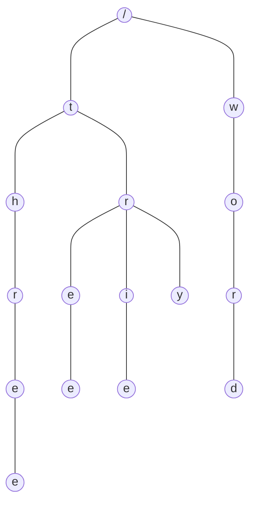

### 概述

Trie 树，名字源于 re**trie**val，意为检索、找回，又称为前缀树、字典树，是一种有序树形结构，是哈希树的变种，用于保存关联数组，通常是字符串。与二叉查找树不同，键不是保存在节点中，而是由节点在树中的位置决定。一个节点的所有子孙都有相同的前缀。一般情况下不是所有的节点都有对应的值，只有叶子节点和部分内部节点所对应的键才有相关的值。




<!-- more -->

### 特点

- 根节点不包含任何字符，除根节点外每个节点只包含一个字符。
- 从根节点到某个节点，路径上经过的字符连接起来，为该节点对应的字符串。
- 每个节点的所有子节点包含的字符串不相同。


### 使用场景

- 字符串检索
- 文本预测、自动完成、拼写检查
- 词频统计
- 排序，先序遍历 Trie 树即可获得字典排序的字符串结果
- 查找字符串最长公共前缀
- 字符串搜索的前缀匹配，如搜索引擎中的搜索提示
- 作为其他数据结构和算法的辅助结构，如后缀树，AC自动机等


### 优缺点

#### 优点

Trie树利用公共前缀，可以最大限度减少无谓的字符比较，缩小查词范围，使得搜索的时间复杂度理论上只与检索词的长度有关，故可以用于词频统计和大量字符串排序。


#### 缺点

- Trie 是一个以空间换时间的算法（尤其是早期的Trie树），每个字符都可能包含至多字符集大小数据的指针。
- 如果数据存储在外部存储器等较慢的位置，Trie 会较 hash 速度慢。
- 长的浮点数等会让链变得很长，可用 bitwise trie 改进。


### 实现方式

#### Array Trie 树

又称经典 Trie 树，实现结构简单，检索效率高。特点是：每个节点都由指针数组存储，每个节点的所有子节点都位于一个数组之中，每个数组都是完全一样的。

对于英文，每个数组有27个指针，包含一个终止符和26个字母，字母按顺序放入数组中。如果包含某个字母，则将数组中对应位置的指针置为可用状态，要查询某个字母是否在节点中，则按直接按位置取用即可。

这种方式利用了元素的值和位置的一一对应关系，实现寻址、存值、取值的统一。

缺点是每一个节点都要有一个等长的数组，包含全部值。在实际使用中会出现很多浪费的数组指针，是典型以空间换时间的做法。


#### List Trie 树

使用 List 替换经典 Trie 树中的数组，解决了空间浪费的问题。但使用链表后，取词时需要遍历链表，降低了查询效率；


#### Hash Trie 树

使用键值对结构替换List，每个节点包含一组 Key-Value，每个key对应该节点下的一个子节点字符，value则指向相应的后一个状态。这种方式能够有效减少空间浪费，查询效率也很高。


#### Double-array Trie 树

双数组树是目前 Trie 树中性能和存储空间均达到很好效果的实现，但实现比较复杂。


### 代码示例

在 Trie 树中，每个节点包含 3 个信息：

- 当前节点值
- 子节点
- 当前节点是否单词结束的节点


#### 经典 Array Trie 树

经典 Trie 树使用数组存储子节点信息，通过数组的下标与字符的对应关系提升存取效率，数组中可多增加一个位置标识是否结束节点。

##### ArrayTrieNode

```java
public class ArrayTrieNode {
    /**
     * 当前节点的值
     */
    private byte content;
    /**
     * 子节点，可存储 26 个字母，再加一个结尾标识
     */
    private ArrayTrieNode[] children = new ArrayTrieNode[27];
    
    // 节约篇幅，省略了 setter 和 getter 方法
}
```


##### ArrayTrie

```java
import java.util.ArrayList;
import java.util.List;

public class ArrayTrie {
    private ArrayTrieNode root = new ArrayTrieNode();
    private final static ArrayTrieNode END_NODE = new ArrayTrieNode();
    private static final byte START_CHARACTER = 'a';

    /**
     * 插入值
     * @param s 字符串值
     */
    public void insert(String s) {
        byte[] bs = s.getBytes();
        ArrayTrieNode currentNode = root;
        for (int i = 0; i < bs.length; i++) {
            byte b = bs[i];
            if (currentNode.getChildren()[b - START_CHARACTER] != null) {
                currentNode = currentNode.getChildren()[b - START_CHARACTER];
            } else {
                ArrayTrieNode newNode = new ArrayTrieNode();
                newNode.setContent(b);
                currentNode.getChildren()[b - START_CHARACTER] = newNode;
                currentNode = newNode;
            }
            if (i == bs.length - 1) {
                currentNode.getChildren()[26] = END_NODE;
            }
        }
    }

    /**
     * 是否包含指定值
     * @param s 要查询的值
     * @return
     */
    public boolean contains(String s){
        byte[] bs = s.getBytes();
        ArrayTrieNode currentNode = root;
        for (int i = 0; i < bs.length; i++) {
            byte b = bs[i];
            if (currentNode.getChildren()[b-START_CHARACTER]==null) return false;
            currentNode = currentNode.getChildren()[b - START_CHARACTER];
            if (i == bs.length - 1 &&  currentNode.getChildren()[26] != null){
               return true;
            }
        }
        return false;
    }

    /**
     * 删除值
     * @param s
     * @return
     */
    public boolean delete(String s){
        byte[] bs = s.getBytes();
        return delete(root, bs, 0);
    }


    /**
     * 删除节点
     * @param trieNode
     * @param content
     * @param index
     * @return
     */
    private boolean delete(ArrayTrieNode trieNode, byte[] content, int index){
        if (index>content.length) return false;
        if (index == content.length  ){
            // 抵达了要删除数组的最后一个, 看看后续还有没有节点，如果有，则不能删除，如果没有，删除并返回true
            if (trieNode.getChildren()[26] == END_NODE){
                return true;
            }
        }
        // 未到最后节点，迭代删除子节点
        if (trieNode.getChildren()[content[index]-START_CHARACTER] == null) return false; // 如果值的节点不存在，返回删除失败

        boolean delSuccess = delete(trieNode.getChildren()[content[index]-START_CHARACTER], content, index+1);
        if (delSuccess){
            // 如果删除子节点成功，判断当前节点是否需要删除
            trieNode.getChildren()[content[index]-START_CHARACTER] = null;
            if (!hasChildren(trieNode)){
                trieNode = null;
                return true;
            }
        }
        return false;
    }

    /**
     * 转换成字符串列表
     * @return
     */
    public List<String> toStringList(){
        List<String> resList = new ArrayList<>();
        List<Byte> byteList = new ArrayList<>();
        saveIntoList(root, byteList, resList, 0);
        return resList;
    }

    private void saveIntoList(ArrayTrieNode trieNode, List<Byte> byteList, List<String> resList, int deep){
        if (trieNode.getContent() != 0 && deep != 0) {
            if (byteList.size() <= deep -1)
                byteList.add(deep-1, trieNode.getContent());
            else
                byteList.set(deep-1, trieNode.getContent());
        }
        if (trieNode.getChildren()[26] == END_NODE){
            // 如果达到了含有结束标记的节点，生成结果，加入列表
            byte[] bs = new byte[byteList.size()];
            for (int i = 0; i < byteList.size(); i++) {
                bs[i] = byteList.get(i);
            }
            resList.add(new String(bs));
        }
        for (int i = 0; i < 26; i++) {
            ArrayTrieNode node = trieNode.getChildren()[i];
            if (node == null) continue;
            saveIntoList(node, byteList, resList, deep + 1);
            byteList = byteList.subList(0, deep);
        }
    }

    /**
     * 判断节点是否有子节点
     * @param trieNode
     * @return
     */
    private boolean hasChildren(ArrayTrieNode trieNode){
        for (int i = 0; i < 26; i++) {
            ArrayTrieNode child = trieNode.getChildren()[i];
            if (child != null) {
                return true;
            }
        }
        return false;
    }
}
```


### 参考资料

- Trie（前缀树/字典树）及其应用: <https://www.cnblogs.com/bonelee/p/8830825.html> 
- 看动画轻松理解「Trie树」: <https://www.sohu.com/a/300621285_115128> 
- 字典树(Trie树)实现与应用: <https://www.cnblogs.com/xujian2014/p/5614724.html> 
- 小白详解 Trie 树: <https://segmentfault.com/a/1190000008877595> 
- Trie - 维基百科: <https://zh.wikipedia.org/wiki/Trie> 
- Trie（前缀树/字典树）及其应用: <https://www.cnblogs.com/justinh/p/7716421.html> 
- Trie Data Structure in Java: <https://www.baeldung.com/trie-java> 


### 总结

Trie 树不是经典的数据结构之一，但在一些场景中会非常有用，值得学习。
