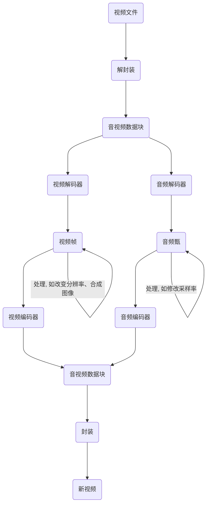
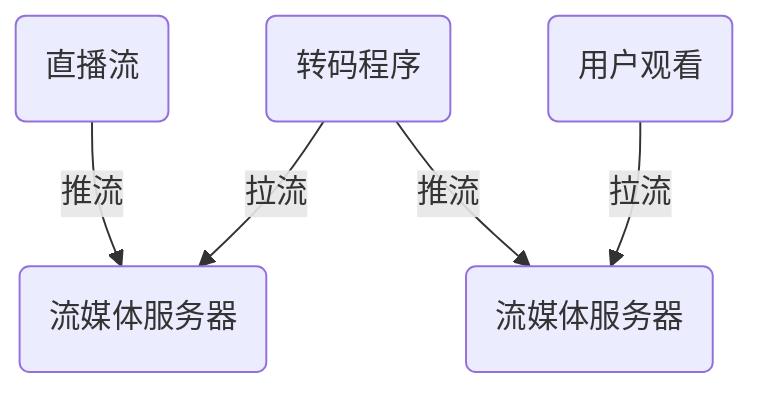
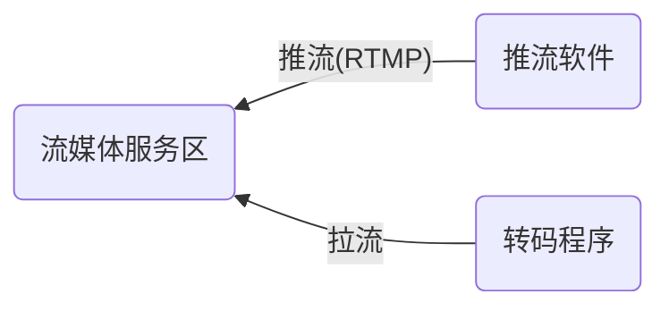
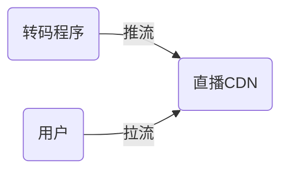
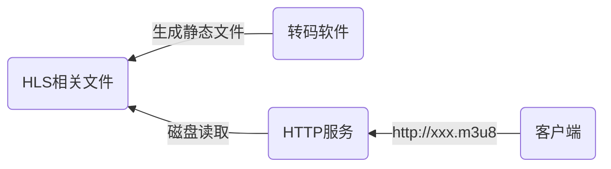
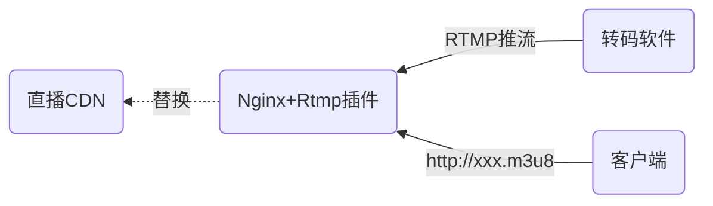

### 概述

这篇文章介绍了当前常见的流媒体服务架构和实现协议，以及各种流媒体协议的特点对比。


### 关于流媒体服务

流媒体服务是提供音频、视频等多媒体数据传输和存储服务，比如视频直播服务。


<!-- more -->


### 流媒体服务工作原理

#### 视频播放转码工作流程



#### 直播工作流程




（1）推流：直播源将视频流推送到流媒体服务器；

（2）转码：转码程序从流媒体服务器拉取视频流，对视频流进行转码，转成用户观看使用的协议，将新的视频流推送到用户观看的流媒体服务器。

> 流媒体服务器作为视频流的中转站，会在内存中实时存储视频流的一部分数据，供用户拉取，随时间推移不断用新数据覆盖。

（3）拉流：用户从流媒体服务器拉取视频流到本地观看。

> 如果直播推流和用户观看拉流使用的协议相同，不需要转码，则只需要一个流媒体服务即可。


### 直播流媒体服务相关协议技术

#### 推流

##### 直播场景相关协议

直播推流一般采用 RTMP 协议推流，流媒体服务软件可以是 SRS、加了 RTMP-server 插件的 Nginx 等。




##### 转播场景相关协议

转播场景下，已经有服务方提供了流媒体服务，只需要让转码程序从其中拉流即可，协议可能是 RTMP、HLS、HTTP-FLV、RTSP等。


##### 录播（视频文件播放）

转码程序直接按时间读取视频文件即可。


#### 直播转码

直播转码程序的意义在于实现一些高级功能，在对直播流进行转码时，可对直播流添加水印、高清/流畅转换、码率限制、直播录像、直播倒计时、自动补帧、导播/轮播、画中画等。

简单的转码工作可交给流媒体服务软件完成，如SRS。


#### 用户拉流

直播观看的协议一般是 HTTP-FLV、HLS 等；如果对延迟要求高，一般使用 RTMP、WEBRTC 等。


直播CDN：

为了减轻服务器压力，可以将转码后的视频流推到第三方直播CDN服务，用户从直播 CDN 服务拉流观看，让直播 CDN 承担多用户拉流的压力，减轻自己服务器带宽压力。



一般使用 RTMP 协议推流到直播CDN，直播 CDN 提供的观看拉流协议一般是 HTTP-FLV、RTMP、HLS等。


### 流媒体协议

| 协议     | 优势                                                         | 使用场景             | 延迟  | 地址                     | 流媒体软件                 |
| -------- | ------------------------------------------------------------ | -------------------- | ----- | ------------------------ | -------------------------- |
| RTMP     | 延迟低，有一定弱网抵抗能力，数据块小重发成本低               | 直播系统内推流       | 1-3s  | `rtmp://`                | SRS、Nginx(rtsp插件)       |
| HTTP-FLV | 适配多个播放场景，加入插件即可播放，网页引入 flv.js 即可播放 | 客户端拉流观看       | 1-3s  | `http://`                | SRS、Nginx(HTTP-FLV插件)   |
| HLS      | 适配多个播放场景，加入插件即可播放，网页引入 hls的js插件即可。不删除视频碎片文件即可生成直播录像。直播转点播、录播更简单（修改m3u8索引文件即可） | 拉流观看             | 5-30s | http://0.0.0.0/live.m3u8 | 不需要，能提供http服务即可 |
| WEBRTC   | 延迟低                                                       | 交互性高的直播       | \<1s  | `webrtc://`              | SRS                        |
| RTSP     | 支持TCP/UDP切换，支持推流/拉流，支持点播/直播                | 监控摄像头等硬件设备 | <1s   | `rtsp://`                | simple-rtsp-server         |

> **SRS** 
>
> SRS (Simple Realtime Server) | SRS: <http://ossrs.net/lts/zh-cn/> 
>
> SRS(Simple Realtime Server)是一个简单高效的实时视频服务器，支持RTMP、WebRTC、HLS、HTTP-FLV、SRT等多种实时流媒体协议。


#### RTMP

RTMP、HTTP-FLV 都是基于 FLV 封装格式。RTMP 一般用于直播源推流，直播系统内直播流数据传递；HTTP-FLV 一般用于客户端直播流观看。

RTMP 协议即可用于推流，也可以用于拉流，RTMP 推流拉流的地址一致，地址以 `rtmp://` 开头。

常见 RTMP 流媒体服务软件：SRS、Nginx(rtmp插件)。

> 由于浏览器废弃了 flash 播放器，且高并发下可能存在稳定性问题，所以 RTMP 一般只用作直播源推流、推流到直播 CDN 等场景。

RTMP 协议基于 TCP 长链接，在封装音视频时会强制对数据切片，限制每个数据包大小，强制切片一定程度保证了实时性，具有一定弱网抵抗能力，因为数据块小传输失败时重发成本低。但数据切片与合并数据块会增加 CPU 压力。


#### HTTP-FLV

HTTP-FLV 协议基于 http 协议，与 RTMP 工作原理相似（可以看做 RTMP 的 HTTP 版本），延迟 1-3 秒（略高于RTMP），HTTP-FlV 一般只用作客户端拉流观看。

> **主流的直播推流拉流协议**
>
> Nginx 的 HTTP-FLV 插件包含了 RTMP 功能，所以一般的 HTTP-FLV 流媒体服务会采用 RTMP 推流，HTTP-FLV 拉流。


#### HLS

HLS 协议是苹果公司发布的标准，在苹果设备上默认支持，与HLS 协议类似的还有 MPEG-DASH 协议（国际标准协议）。只用于拉流观看，可用于直播、点播观看。原理是通过http 协议下载静态文件，其中包含一个索引文件（`.m3u8` 文件）和多个只有几秒的视频文件（`.ts` 文件），索引文件中记录了相关视频文件的路径。客户端先获取索引文件，然后从索引文件中获取视频碎片文件的下载路径，然后下载视频碎片文件进行播放。

> HLS 的视频碎片文件是直接写入磁盘的，所以不需要特殊的流媒体软件。

点播场景下，索引文件中会记录所有视频碎片文件地址、时长。由于 HLS相关文件是无状态的静态文件，且每个文件大小是有限的，所以负载均衡、CDN 加速的效果更加明显。HLS 的点播视频会比 mp4、flv 视频更快地播放出来，且在加载中跳转视频会更加顺滑。

直播场景下，转码文件直接生成 HLS 相关文件到磁盘，客户端通过 http 服务下载静态文件即可。



直播场景下，也可以让转码软件将直播流以 RTMP 推送到安装了RTMP 插件的 Nginx 服务，由 Nginx 生成 HLS 相关文件，用户直接访问 Nginx 提供的 http 服务。在后续业务中可直接将 Nginx 替换成直播CDN ，无需修改架构。



> 直播场景下的索引文件会随时间改变，因为视频碎片文件在改变，且索引文件中记录的视频碎片文件数量是有上限的，当达到上限时，默认会删除旧的视频碎片文件并更新索引文件，因此客户端需要不断重新获取索引文件，从而获得新的视频文件地址。

m3u8 索引文件支持二级索引，可以将不同清晰度（高清、标清、流畅等）的地址整合到一个索引文件中，也可以支持音视频分离，播放器可以根据当前带宽自动切换不同的观看地址。

> 优化建议：由于 HLS 协议需要将视频碎片文件写入磁盘，直播场景下会有大量的写磁盘操作，将会严重损耗磁盘使用寿命。建议将一段内存空间作为 HLS 文件的写入位置，将文件写入内存而非磁盘。这种方式在系统重启时会丢失数据，可做一些定时备份的措施。
>
> ```shell
> mount -t tmpfs -o size=10g tmpfs /data
> ```
>
> 如以上 linux 命令，可将视频文件写入 /data 目录。


#### WEBRTC

WebRTC 是一种点对点的视频/语音通话协议，是基于 UDP 的，延迟低（1秒内），适合交互性较高的场景，如直播带货、视频会议。

WebRTC 支持推流和拉流，地址一般以 `webrtc//` 开头，推流与拉流地址一般也是相同的。

WebRTC 设计为点对点的通信协议，在直播场景下，需要搭建 WebRTC 服务为用户提供连接服务，可用的流媒体服务软件：SRS。


#### RTSP

一般用于摄像头等硬件设备的实时视频观看、推流。

RTSP支持推流、拉流，可切换 TCP/UDP，支持点播、直播。

一般不用于直播，现代浏览器不支持，在 web 领域一般不使用 RTSP。


### 参考资料

- 【音视频处理】直播工作原理，直播CDN、推流拉流、流媒体服务究竟是什么_哔哩哔哩_bilibili: <https://www.bilibili.com/video/BV1fm4y117Qe/> 
- 【音视频处理】RTMP、HLS、HTTP-FLV、WebRTC、RTSP的区别？直播协议详解_哔哩哔哩_bilibili: <https://www.bilibili.com/video/BV1Xc411T79K/> 
