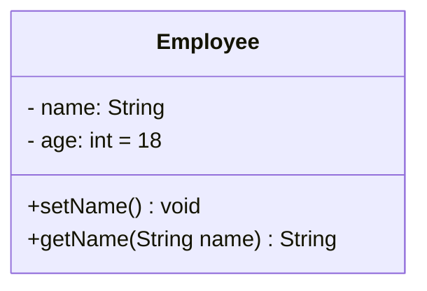
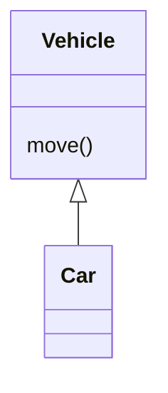
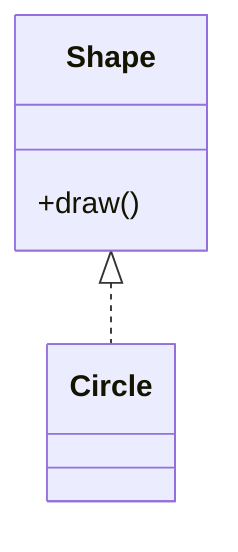
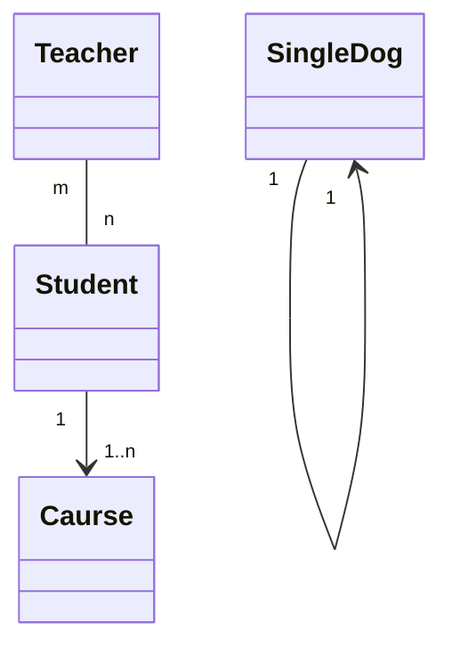
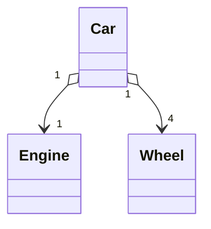
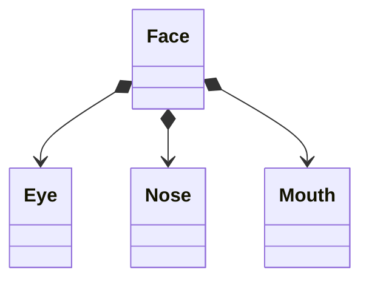
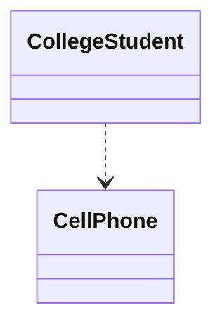
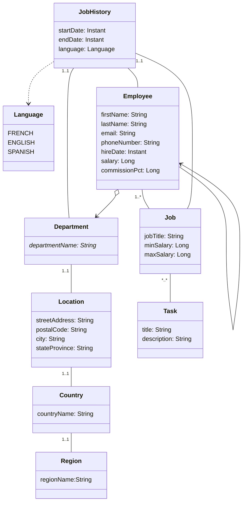
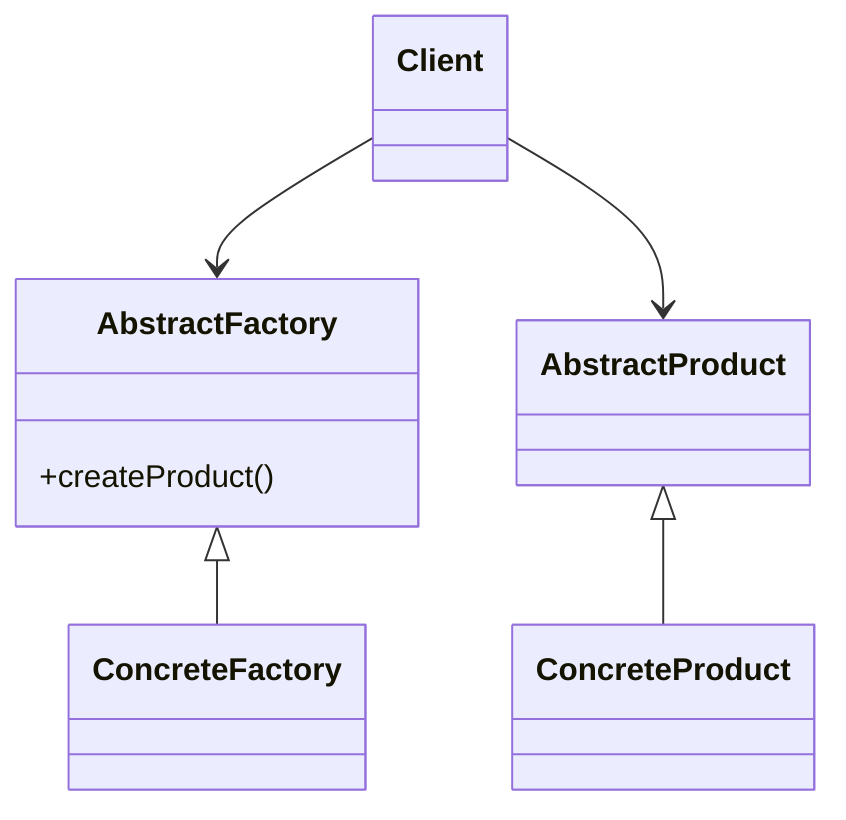

### 概述

UML图是程序员必须学会的基础知识，这篇文章介绍了UML类图的使用方法。


### 什么是 UML 类图

UML (Uinfied Modeling Language)，统一建模语言，是广泛使用的开发建模工具，是面向对象设计的建模工具，独立于任何具体程序设计语言。UML图有用例图、协作图、活动图、序列图、部署图、构件图、类图、状态图，其中类图用于描述系统中的类，以及各个类之间的关系，是使用频率最高的UML图之一。


<!-- more -->

### UML 类图元素

类图用于描述类以及类之间的关系，帮助读者理解系统设计。

#### 类

类封装了数据和行为，是具有相同属性、操作、关系的对象集合的总称。

类图中分为三个部分，分别是：

- 类名

  在类名上还可以增加注释明确说明类的类型或功能，如 `<<Interface>>` 接口、`<<abstract>>` 抽象类、`<<Service>>` 服务类、`<<enumeration>>` 枚举类。

- 属性

  表示方式：`可见性 属性名: 类型 [=初始值]` 

  可见性包括：`+` 公有(public)、`-` 私有(private)、`#` 受保护(protected)

  类型可以是基本数据类型，也可以是用户自定义类型，如自定义的类

  初始值是一个可选项

- 方法

  表示方式: `可见性 方法名(参数列表) [:返回值类型]` 

  可见性与属性的可见性相同。

  参数列表中参数个数是任意的，可以没有参数，多个参数以逗号 `,` 分隔。

  返回值类型是一个可选项，可以是基础数据类型或自定义类型，还可以是 void，表示返回值为空。如果是构造方法，则无返回类型。




#### 类与类之间的关系

##### 泛化

继承关系，子类继承父类的特征和行为。

表现形式：实线，带三角箭头，箭头指向父类。




##### 实现

类与接口的关系，类实现接口所有特性和行为。

表现形式：虚线，带三角箭头，箭头指向接口。在接口名上可增加 `<<interface>>` 标明是一个接口类。




##### 关联

最常见的一种关系，表示一类对象与另一类对象之间又联系，如汽车和轮胎，班级和学生等。

UML 类图中用实线连接有关联关系的类，在 java 中实现关联关系时，通常表现为一个类的对象作为另一个类的成员变量。

表现形式：实线，双向关联可以有两个箭头，也可以没有箭头；单向关联有一个箭头，指向被拥有者。




##### 聚合

整体与部分的关系，部分可以离开整体单独存在。是一种较强的关联关系，如汽车和轮胎，轮胎是汽车的一部分，而又可以单独存在。

在代码中表现为部分作为整体的成员变量。

表现形式：实线，带空心菱形和箭头，菱形指向整体，箭头指向部分。




##### 组合

整体与部分的关系，部分不能离开整体单独存在。如公司和部门，没有公司就没有部门。

在代码中表现为部分作为整体的成员变量。

表现形式：实线，带实心菱形和箭头，菱形指向整体，箭头指向部分。




##### 依赖

是一种使用的关系，一个类的实现需要另一个类的协助。如大学生和手机，现在的大学生已经对手机产生了强烈的依赖。

在代码中表现为作为局部变量、方法的参数，或对静态方法的调用。

表现形式：虚线，带箭头，箭头指向被使用者。




### 示例




### 绘制工具

#### 在线工具

##### ProcessOn

地址：<https://www.processon.com/> 


ProcessOn是一个在线作图工具的聚合平台。

支持流程图、思维导图、UI原型图、UML、网络拓扑图、组织结构图等等。

支持团队实时协作。

支持导出图片文件。


##### Draw.io

地址：<https://www.diagrams.net/> 


**开源**的网页绘图设计工具，github 地址 : <https://github.com/jgraph/drawio> 。

支持流程图、图表、网络图、UML图、商务图等。

支持中文以及多种语言。

支持 github 登陆，可以将文件(`.drawio` 文件) 直接存储到 github 仓库中。


#### 绘制软件

##### 亿图 (付费)

地址: <http://www.edrawsoft.cn/> 


亿图图示是一个简单易用的图形表达工作台，既能实现流程图、架构图、工程图、思维导图等数百种专业领域图形图表的绘制，又能提供一个白板进行头脑风暴和任意编排，轻松实现数据和创意的可视化呈现。支持Windows、Mac、Linux及网页版，一端创作，多端同步。


#### 其他相关绘图技术

##### PlantUML

地址: <https://plantuml.com/zh/> 

PlantUML 是一个开源项目，支持用文字描述的方式来定义时序图、用例图、类图、状态图等。

在很多 IDE 中，可以安装插件来支持 PlantUML，如 Eclipse、Intellij idea、VS code 等。


##### Markdown

在 Markdown 文档中，可以使用 mermaid 图编写类图。

更多语法参考官方文档：<https://mermaid-js.github.io/mermaid/#/classDiagram> 

如：

```
classDiagram
    Client --> AbstractFactory
    Client --> AbstractProduct
    AbstractFactory <|-- ConcreteFactory
    AbstractProduct <|-- ConcreteProduct
    class AbstractFactory{
        +createProduct()
    }
```

效果：




### 参考资料

- 深入浅出UML类图: <http://www.uml.org.cn/oobject/201211231.asp> 
- 最全面的UML教程: <https://segmentfault.com/a/1190000014498340> 
- 浅谈UML中常用的几种图: <https://blog.csdn.net/qq_35495763/article/details/80764914> 


### 总结

UML 是一套标准的设计工具，用来阐述程序设计非常方便，而且通用，用这个跟别人交流能够让人快速了解程序设计。UML类图用来描述程序中的类设计，能反映出数据库设计，以及业务逻辑设计，学好和使用好 UML 类图对于程序开发非常重要。