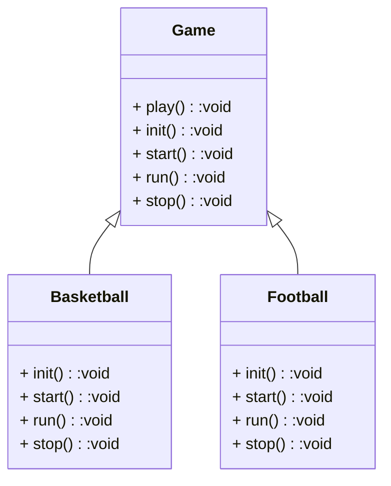

### 概述

这篇文章介绍了模板方法模式，这是一个很简单而应用广泛的设计模式，仅仅使用到类的继承机制。




### 关于模板方法模式

模板方法模式（Template Method Pattern），定义一个操作中的算法的框架，而将一些步骤延迟到子类中。使得子类可以不改变一个算法的结构即可重定义该算法的某些特定步骤。

模板方法模式，是一种行为模式，目的是减少重复代码，特点是把固定不变的逻辑作为一个模板方法，放到父类中，其中的具体操作步骤由子类实现，来完成总体逻辑一致，但又存在个体差异的行为。


<!-- more -->

### 应用场景

- 有基本相同逻辑或算法的类
- 重要、复杂的算法，可以把核心算法设计成模板方法
- 重构时，可以使用模板方法模式，将相同代码抽取到父类中


### 优缺点

#### 优点

- 封装不变部分，扩展可变部分
- 提取公共部分代码，便于维护
- 行为由父类控制，子类实现

#### 缺点

子类的行为影响到了父类，与一般的设计习惯相反，对初学者来说代码变得复杂，增加了阅读难度。


### 代码示例

#### 父类

父类中的模板方法确定了业务逻辑，用 `final` 修饰，防止子类修改逻辑。定义了基本方法，由子类实现。

Game.java

```java
public abstract class Game {
    public abstract void init();

    public abstract void start();

    public abstract void run();

    public void stop() {
        System.out.println("结束比赛，统计分数");
    }

    public final void platy(){
        init();
        start();
        run();
        stop();
    }
}
```


#### 子类

子类中根据具体场景实现基本方法。

BasketballGame.java

```java
public class BasketballGame extends Game {
    @Override
    public void init() {
        System.out.println("创建篮球场...");
        System.out.println("创建篮球");
        System.out.println("创建篮球运动员");
    }

    @Override
    public void start() {
        System.out.println("开始比赛");
    }

    @Override
    public void run() {
        System.out.println("篮球比赛进行中");
    }
}
```

FootballGame.java

```java
public class FootballGame extends Game {
    @Override
    public void init() {
        System.out.println("创建足球场...");
        System.out.println("创建足球");
        System.out.println("创建足球运动员");
    }

    @Override
    public void start() {
        System.out.println("开始比赛");
    }

    @Override
    public void run() {
        System.out.println("足球比赛进行中");
    }
}
```


#### 测试

```java
public class Main {
    public static void main(String[] args) {
        new Basketball().platy();
        new Football().platy();
    }
}
```


### 扩展

模板方法不能修改，当某些子类中的处理逻辑不相同时，可以使用钩子方法来灵活控制模板方法的逻辑。如：

父类：

```java
public abstract class Game {

    // 钩子方法，子类覆写这个方法，修改返回值，即可控制执行逻辑
    protected boolean needInit(){
        return true; // 默认情况下需要初始化
    }

    public abstract void init();

    public abstract void start();

    public abstract void run();

    public void stop() {
        System.out.println("结束比赛，统计分数");
    }

    public final void platy(){
        if (this.needInit()) {
            init();
        }
        start();
        run();
        stop();
    }
}
```

子类：

```java
public class ImagineGame extends Game {
    // 覆写钩子方法，让返回值变成 false
    @Override
    protected boolean needInit() {
        return false;
    }

    @Override
    public void init() {
        // 不会被执行
    }

    @Override
    public void start() {
        System.out.println("开始想象");
    }

    @Override
    public void run() {
        System.out.println("想象游戏中");
    }
}
```


### 注意事项

在模板方法模式中，基本方法由子类实现，基本方法一般使用 protected 修饰，由子类实现。模板方法调用基本方法完成固定的逻辑，**为了防止恶意操作，一般模板方法都使用 final 修饰，不允许被覆写**。可以有多个模板方法。


### 参考资料

- 程杰· 大话设计模式
- 秦小波· 设计模式之禅（第二版）

