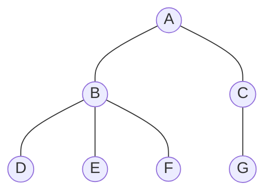
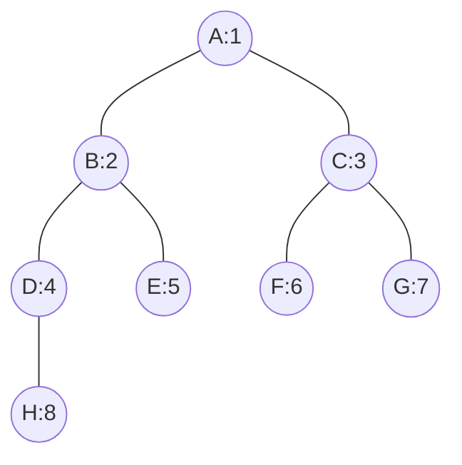

### 概述

在开发中很容易遇到树状结构的数据，比如公司管理层级、比如目录结构等等，当用关系型数据库存储这些数据时，如何设计存储结构以提高查询效率就是一个问题了。这篇文章介绍了使用闭包（Closure Table）表来存储树状结构数据。





### 闭包表

闭包表是一张记录树中所有节点以及节点之间的距离的关系表。使用闭包表能够轻松的查询结点的所有子孙节点、父节点，能够按距离查询。但闭包表的使用也会带来一些问题，因为闭包表中记录了所有节点之间的关系，所以在新增节点或修改节点时，都需要变更闭包表，要小心的维护这个表才能保证查询结果正确。

<!-- more -->


### 传统做法

在传统做法中，为了存储树状数据，需要在数据中增加字段指向其上级。如：

```java
class Employee {
    private Long id;
    private String name;
    private Long parentId; // 上级的 ID
}
```

这种方式很容易理解，很方便查找一个职员的直属上级和一个领导的直属下级。但也存在一些问题，当管理层级大于两级后就会比较麻烦，如查找一个领导的所有下属职员，或者查询一个员工的所有上级领导，一般需要使用递归来查询。


### 使用闭包表

#### 实体设计

使用闭包表后，实体中就可以不添加上级 id 了，但需要另一张表来存储节点关联信息。

- Employee.java

  ```java
  class Employee {
      private Long id;
      private String name;
  }
  ```

- EmployeePath.java

  ```java
  class EmployeePath {
      private Long ancestorId; // 祖先ID
      private Long descendantId; // 子孙ID
      private Integer deepth; // 节点深度
      private Boolean leaf; // 是否叶子节点
  }
  ```

在闭包表中，*ancestorId* 是上级 ID，*descendantId* 是下级 ID，*depth* 是上级到下级的层数，*leaf* 表示该节点是否是叶子节点。

#### 数据示例



#### 示例数据 employee

| id   | name |
| ---- | ---- |
| 1    | A    |
| 2    | B    |
| 3    | C    |
| 4    | D    |
| 5    | E    |
| 6    | F    |
| 7    | G    |
| 8    | H    |

#### 闭包表示例数据 employee_path

在记录节点关系的闭包表中，包含节点的所有上级与节点自身的关系记录，还有一条节点自身的记录。如示例中的 `H` 节点，其上级分别是 `D` 、`B` 、`A` ，所以在关系表中需要添加 `H` 节点自身（深度为 0），以及 `D-H` 、`B-H` 、`A-H` 的记录，他们的深度分别是 1、2、3。

| ancestorId | descendantId | deepth | leaf |
| :--------: | :----------: | :----: | :--: |
|     1      |      1       |   0    |  0   |
|     2      |      2       |   0    |  0   |
|     1      |      2       |   1    |  0   |
|     3      |      3       |   0    |  0   |
|     1      |      3       |   1    |  0   |
|     4      |      4       |   0    |  0   |
|     1      |      4       |   2    |  0   |
|     2      |      4       |   1    |  0   |
|     8      |      8       |   0    |  1   |
|     1      |      8       |   3    |  1   |
|     2      |      8       |   2    |  1   |
|     4      |      8       |   1    |  1   |
|    ...     |     ...      |  ...   | ...  |

#### 查询示例

- 查找 `D` 节点(id=4)的所有上级节点：

  ```sql
  select e.* from employee e, employee_path ep where e.id =ep.ancestorId and ep.descendantId = 4;
  ```

  

- 查找 `B` 节点(id=2)的所有下级节点：

  ```sql
  select e.* from employee e, employee_path ep where e.id = ep.descendantId and ep.ancestorId = 2;
  ```

#### 更新闭包表数据

当我们增加节点或修改数据的层级结构时，都需要更新闭包表中的数据。当新增一个节点时，需要取出其所有父节点，添加所有父节点到当前节点的关系记录。当修改一个节点关联时，需要先把原有的记录都删除，然后添加这个节点的所有上级和下级节点的关联关系。删除时需要删除所有包含这个节点的记录。


### 参考资料

- tree闭包表: <https://www.jianshu.com/p/ae2eac1069a9> 
- 树形结构的数据如何保存到关系型的数据库: <https://blog.csdn.net/jim8757/article/details/52385612> 


### 总结

使用闭包表在查询多层级的树状结构数据时非常方便，但维护这个表中的关联关系会有些麻烦，要非常小心。

